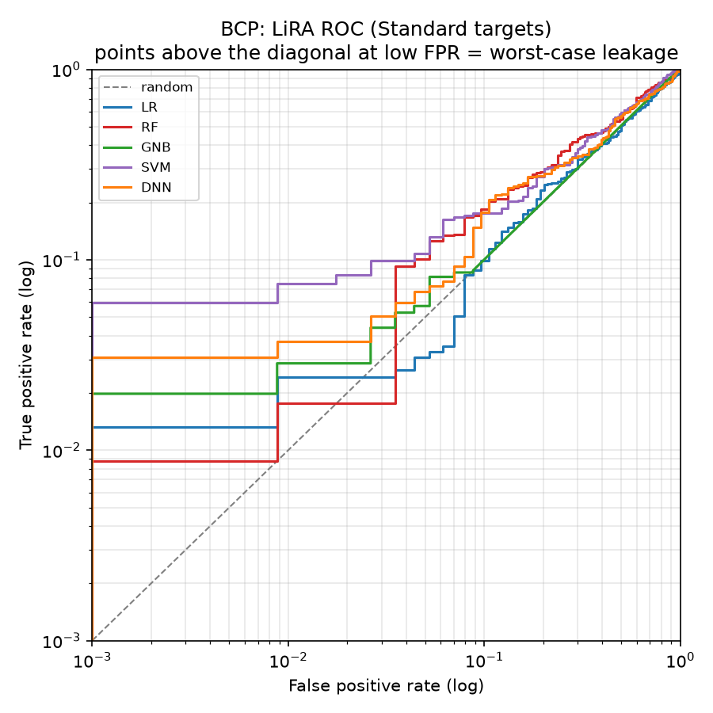
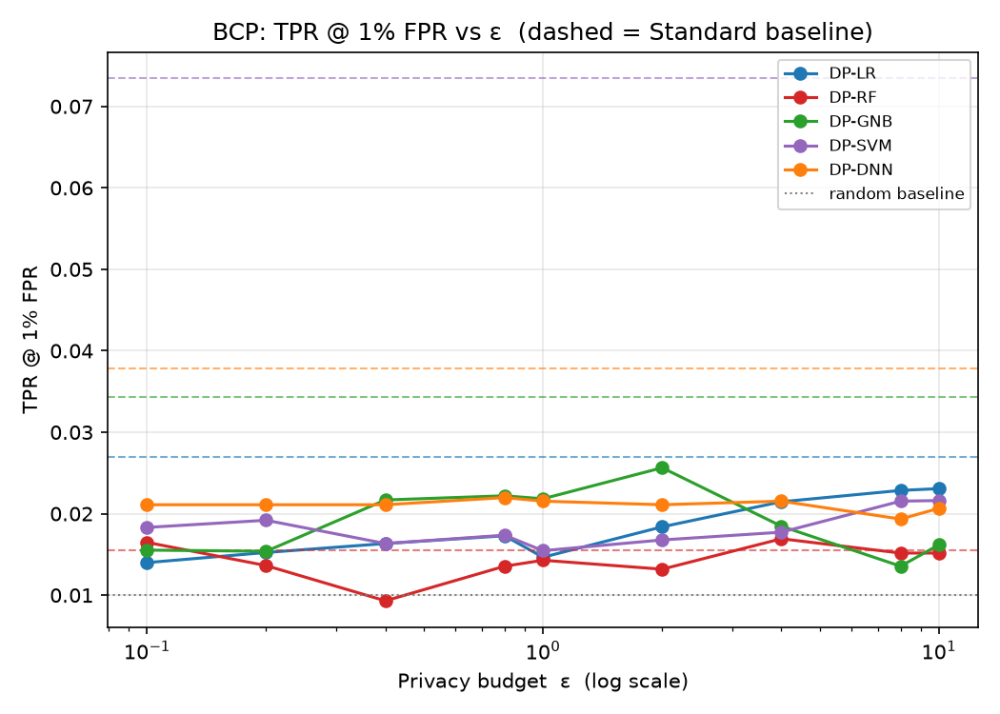
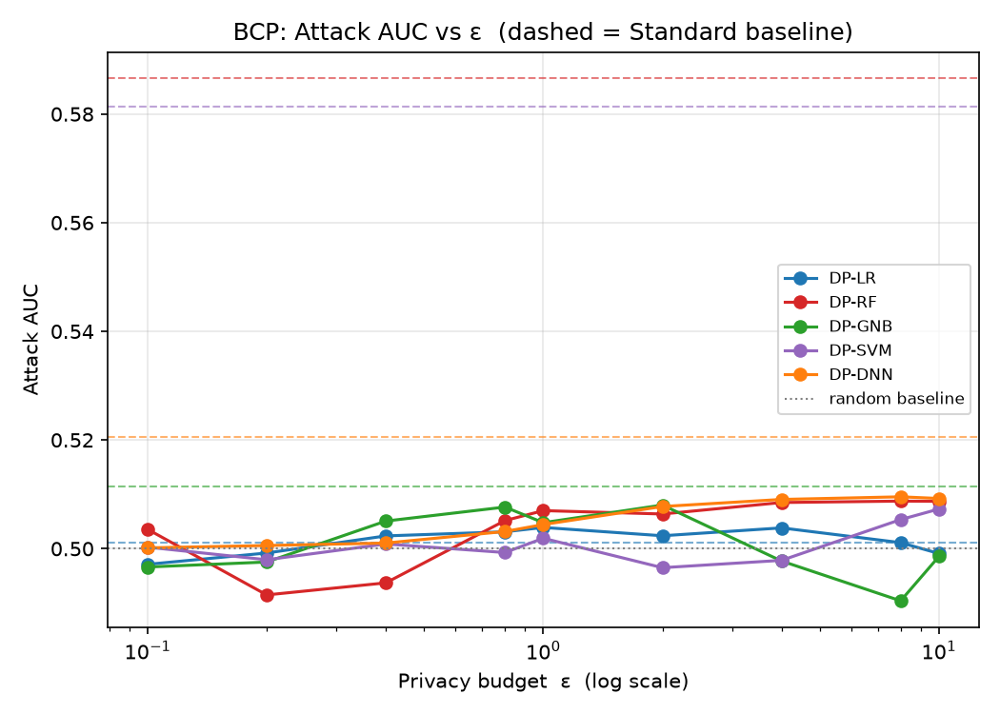
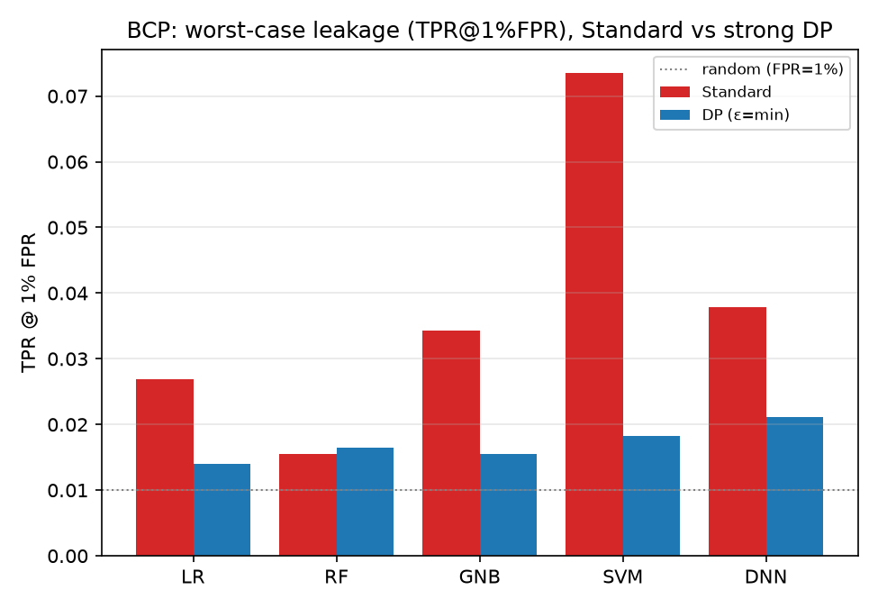

# BCP — LiRA (Likelihood Ratio Attack) Analysis

*Auto-generated by `run_lira.py`. Raw numbers: `BCP_lira_results.csv`.*

LiRA — Carlini, Tramèr, Terzis, Song, Steinke, Jagielski, Erlingsson, Oprea et al. (2022), *Membership Inference Attacks From First Principles* (IEEE S&P, arXiv:2112.03404) — run against the **exported** targets in `BCP/<family>/output/model/`.

## 1. Why LiRA, on top of Shokri + Yeom
Shokri (shadow models) and Yeom (loss threshold) are **average-case** attacks: a single rule for every record, summarised by AUC / advantage near 0.5. LiRA is **per-example** — for each record it asks whether the target's confidence is more consistent with models trained *with* that record (IN) or *without* it (OUT), via a Gaussian likelihood-ratio test on logit-scaled confidence. This surfaces the few records that leak strongly even when the average AUC is ~0.5, so the headline metric is **TPR at a low fixed FPR**, not AUC.

## 2. What was run
| Item | Value |
|------|-------|
| Samples | N = 569 (455 train / 114 test) |
| Classes | 2 |
| Features | 30 |
| Shadow models / target | 32 (trained on **real** random halves) |
| DP budgets ε | 0.1, 0.2, 0.4, 0.8, 1, 2, 4, 8, 10 |
| Membership ground truth | record ∈ target's training set (X_train) |
| Evaluation set | 455 members : 114 non-members (4:1) — the raw train/test split |
| Score | online LiRA, log N(φ;μ_in,σ) − log N(φ;μ_out,σ), fixed σ |

## 3. How to read it
| Metric | Meaning | No leak | Leak |
|--------|---------|---------|------|
| TPR @ 1% FPR | members caught while wrongly flagging 1% of non-members | 0.01 | ≫ 0.01 |
| TPR @ 0.1% FPR | the strict worst-case (limited by #non-members) | 0.001 | ≫ 0.001 |
| Attack AUC | average-case ranking quality | 0.5 | > 0.6 |
| Advantage | max(TPR − FPR) over thresholds | 0.0 | > 0.1 |

## 4. Results
| Model | Variant | ε | AUC | TPR@10% | TPR@1% | TPR@0.1% | Advantage | Test acc |
|-------|---------|---|-----|---------|--------|----------|-----------|----------|
| LR | Standard | ∞ | 0.501 | 0.112 | 0.027 | 0.017 | 0.064 | 0.912 |
| LR | DP | 0.1 | 0.497 | 0.110 | 0.014 | 0.008 | 0.069 | 0.658 |
| LR | DP | 0.2 | 0.499 | 0.102 | 0.015 | 0.006 | 0.064 | 0.675 |
| LR | DP | 0.4 | 0.502 | 0.095 | 0.016 | 0.006 | 0.059 | 0.693 |
| LR | DP | 0.8 | 0.503 | 0.108 | 0.017 | 0.010 | 0.062 | 0.667 |
| LR | DP | 1 | 0.504 | 0.102 | 0.015 | 0.005 | 0.064 | 0.719 |
| LR | DP | 2 | 0.502 | 0.097 | 0.018 | 0.010 | 0.063 | 0.851 |
| LR | DP | 4 | 0.504 | 0.099 | 0.021 | 0.013 | 0.064 | 0.904 |
| LR | DP | 8 | 0.501 | 0.102 | 0.023 | 0.014 | 0.060 | 0.904 |
| LR | DP | 10 | 0.499 | 0.103 | 0.023 | 0.014 | 0.060 | 0.912 |
| RF | Standard | ∞ | 0.587 | 0.173 | 0.015 | 0.009 | 0.163 | 0.947 |
| RF | DP | 0.1 | 0.504 | 0.100 | 0.016 | 0.005 | 0.074 | 0.711 |
| RF | DP | 0.2 | 0.491 | 0.097 | 0.014 | 0.006 | 0.051 | 0.711 |
| RF | DP | 0.4 | 0.494 | 0.095 | 0.009 | 0.005 | 0.056 | 0.746 |
| RF | DP | 0.8 | 0.505 | 0.110 | 0.014 | 0.007 | 0.068 | 0.746 |
| RF | DP | 1 | 0.507 | 0.105 | 0.014 | 0.006 | 0.065 | 0.746 |
| RF | DP | 2 | 0.506 | 0.105 | 0.013 | 0.006 | 0.065 | 0.798 |
| RF | DP | 4 | 0.508 | 0.116 | 0.017 | 0.009 | 0.070 | 0.763 |
| RF | DP | 8 | 0.509 | 0.118 | 0.015 | 0.008 | 0.071 | 0.763 |
| RF | DP | 10 | 0.509 | 0.118 | 0.015 | 0.008 | 0.071 | 0.763 |
| GNB | Standard | ∞ | 0.511 | 0.105 | 0.034 | 0.023 | 0.037 | 0.921 |
| GNB | DP | 0.1 | 0.497 | 0.103 | 0.016 | 0.009 | 0.062 | 0.368 |
| GNB | DP | 0.2 | 0.498 | 0.100 | 0.015 | 0.009 | 0.056 | 0.684 |
| GNB | DP | 0.4 | 0.505 | 0.113 | 0.022 | 0.012 | 0.061 | 0.623 |
| GNB | DP | 0.8 | 0.508 | 0.112 | 0.022 | 0.013 | 0.068 | 0.632 |
| GNB | DP | 1 | 0.505 | 0.104 | 0.022 | 0.012 | 0.066 | 0.632 |
| GNB | DP | 2 | 0.508 | 0.118 | 0.026 | 0.015 | 0.074 | 0.632 |
| GNB | DP | 4 | 0.498 | 0.111 | 0.018 | 0.010 | 0.060 | 0.693 |
| GNB | DP | 8 | 0.490 | 0.096 | 0.014 | 0.007 | 0.048 | 0.658 |
| GNB | DP | 10 | 0.499 | 0.106 | 0.016 | 0.007 | 0.056 | 0.746 |
| SVM | Standard | ∞ | 0.581 | 0.200 | 0.073 | 0.057 | 0.143 | 0.947 |
| SVM | DP | 0.1 | 0.500 | 0.100 | 0.018 | 0.011 | 0.058 | 0.553 |
| SVM | DP | 0.2 | 0.498 | 0.104 | 0.019 | 0.008 | 0.060 | 0.667 |
| SVM | DP | 0.4 | 0.501 | 0.104 | 0.016 | 0.008 | 0.063 | 0.368 |
| SVM | DP | 0.8 | 0.499 | 0.103 | 0.017 | 0.009 | 0.063 | 0.807 |
| SVM | DP | 1 | 0.502 | 0.107 | 0.015 | 0.008 | 0.063 | 0.868 |
| SVM | DP | 2 | 0.497 | 0.105 | 0.017 | 0.009 | 0.057 | 0.895 |
| SVM | DP | 4 | 0.498 | 0.101 | 0.018 | 0.010 | 0.053 | 0.904 |
| SVM | DP | 8 | 0.505 | 0.100 | 0.022 | 0.011 | 0.064 | 0.904 |
| SVM | DP | 10 | 0.507 | 0.102 | 0.022 | 0.012 | 0.066 | 0.904 |
| DNN | Standard | ∞ | 0.521 | 0.133 | 0.038 | 0.027 | 0.077 | 0.974 |
| DNN | DP | 0.1 | 0.500 | 0.111 | 0.021 | 0.012 | 0.065 | 0.632 |
| DNN | DP | 0.2 | 0.501 | 0.113 | 0.021 | 0.012 | 0.068 | 0.632 |
| DNN | DP | 0.4 | 0.501 | 0.116 | 0.021 | 0.012 | 0.075 | 0.632 |
| DNN | DP | 0.8 | 0.503 | 0.116 | 0.022 | 0.011 | 0.078 | 0.632 |
| DNN | DP | 1 | 0.504 | 0.121 | 0.022 | 0.011 | 0.073 | 0.632 |
| DNN | DP | 2 | 0.508 | 0.125 | 0.021 | 0.011 | 0.075 | 0.632 |
| DNN | DP | 4 | 0.509 | 0.135 | 0.022 | 0.010 | 0.074 | 0.632 |
| DNN | DP | 8 | 0.510 | 0.131 | 0.019 | 0.012 | 0.069 | 0.763 |
| DNN | DP | 10 | 0.509 | 0.123 | 0.021 | 0.011 | 0.070 | 0.842 |

## 5. Figures
### LiRA ROC (log-log, Standard targets)



The diagnostic LiRA view. A curve hugging the diagonal at low FPR means no worst-case leakage; a curve bowing up on the left means specific records are reliably identified as members.

### TPR@1%FPR vs ε



Worst-case leakage for each DP model across the budget; dashed = Standard baseline, dotted = random (0.01). Lower is more private.

### Attack AUC vs ε



Average-case ranking quality; 0.5 is random. Provided for continuity with the Shokri/Yeom results.

### TPR@1%FPR: Standard vs strong DP



Per family, non-private vs strongest-privacy DP worst-case leakage.

## 6. Interpretation
Strongest worst-case leakage among the **Standard** models: **SVM** at TPR@1%FPR = **0.073** (AUC 0.581), vs the 0.01 random baseline. LiRA is a strictly stronger attack than the average-case Shokri/Yeom runs, so this is the most adversarial membership estimate in the study.

Under DP, the worst case drops to TPR@1%FPR = **0.026** (GNB, ε=2) — quantifying the protection DP buys at the per-record level.

> Caveat: TPR at very low FPR is bounded by the number of non-members (114 here), and the DNN shadows are non-private even for DP-DNN targets (an approximation inherited from the shadow factory). Treat 0.1% FPR as indicative, 1% FPR as the robust worst-case figure.

## 7. Reproduce
```bash
cd Attack/LiRA
python3 run_lira.py --datasets BCP --n-shadow 32
```