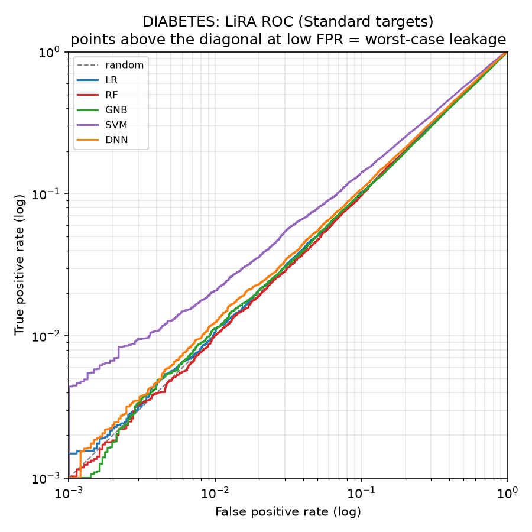
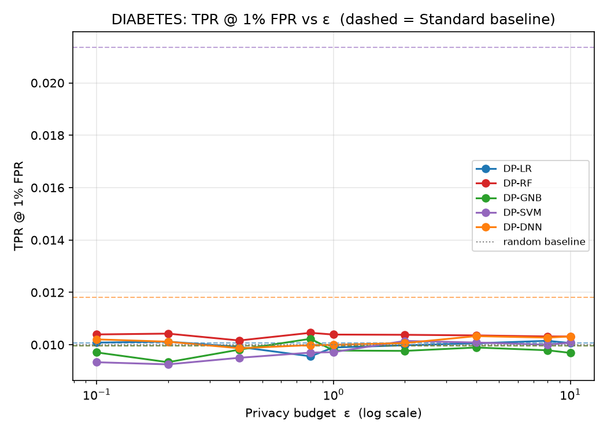
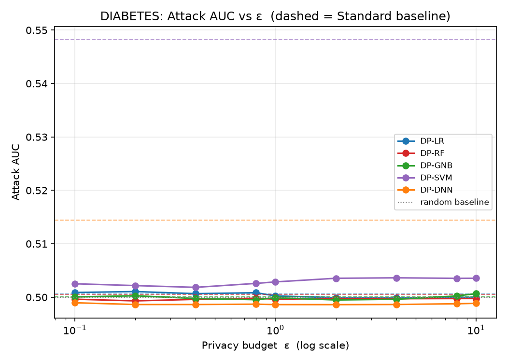
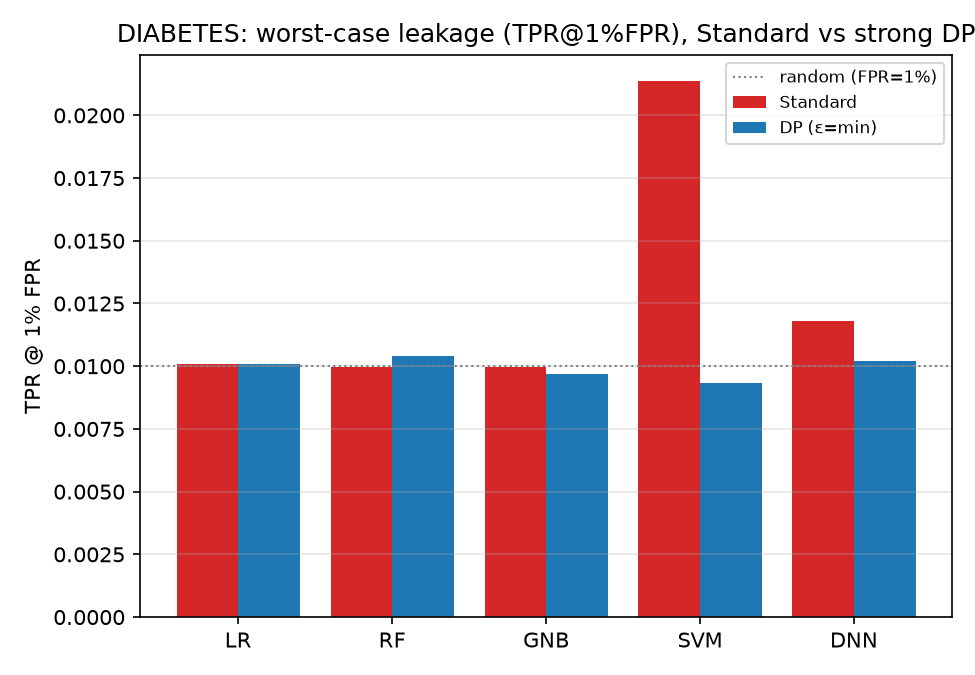

# DIABETES — LiRA (Likelihood Ratio Attack) Analysis

*Auto-generated by `run_lira.py`. Raw numbers: `DIABETES_lira_results.csv`.*

LiRA — Carlini, Tramèr, Terzis, Song, Steinke, Jagielski, Erlingsson, Oprea et al. (2022), *Membership Inference Attacks From First Principles* (IEEE S&P, arXiv:2112.03404) — run against the **exported** targets in `DIABETES/<family>/output/model/`.

## 1. Why LiRA, on top of Shokri + Yeom
Shokri (shadow models) and Yeom (loss threshold) are **average-case** attacks: a single rule for every record, summarised by AUC / advantage near 0.5. LiRA is **per-example** — for each record it asks whether the target's confidence is more consistent with models trained *with* that record (IN) or *without* it (OUT), via a Gaussian likelihood-ratio test on logit-scaled confidence. This surfaces the few records that leak strongly even when the average AUC is ~0.5, so the headline metric is **TPR at a low fixed FPR**, not AUC.

## 2. What was run
| Item | Value |
|------|-------|
| Samples | N = 70692 (56553 train / 14139 test) |
| Classes | 2 |
| Features | 21 |
| Shadow models / target | 32 (trained on **real** random halves) |
| DP budgets ε | 0.1, 0.2, 0.4, 0.8, 1, 2, 4, 8, 10 |
| Membership ground truth | record ∈ target's training set (X_train) |
| Evaluation set | 56553 members : 14139 non-members (4:1) — the raw train/test split |
| Score | online LiRA, log N(φ;μ_in,σ) − log N(φ;μ_out,σ), fixed σ |

## 3. How to read it
| Metric | Meaning | No leak | Leak |
|--------|---------|---------|------|
| TPR @ 1% FPR | members caught while wrongly flagging 1% of non-members | 0.01 | ≫ 0.01 |
| TPR @ 0.1% FPR | the strict worst-case (limited by #non-members) | 0.001 | ≫ 0.001 |
| Attack AUC | average-case ranking quality | 0.5 | > 0.6 |
| Advantage | max(TPR − FPR) over thresholds | 0.0 | > 0.1 |

## 4. Results
| Model | Variant | ε | AUC | TPR@10% | TPR@1% | TPR@0.1% | Advantage | Test acc |
|-------|---------|---|-----|---------|--------|----------|-----------|----------|
| LR | Standard | ∞ | 0.501 | 0.101 | 0.010 | 0.001 | 0.006 | 0.746 |
| LR | DP | 0.1 | 0.501 | 0.101 | 0.010 | 0.001 | 0.006 | 0.716 |
| LR | DP | 0.2 | 0.501 | 0.099 | 0.010 | 0.001 | 0.007 | 0.734 |
| LR | DP | 0.4 | 0.501 | 0.099 | 0.010 | 0.001 | 0.007 | 0.743 |
| LR | DP | 0.8 | 0.501 | 0.098 | 0.010 | 0.001 | 0.008 | 0.740 |
| LR | DP | 1 | 0.500 | 0.098 | 0.010 | 0.001 | 0.006 | 0.745 |
| LR | DP | 2 | 0.500 | 0.099 | 0.010 | 0.001 | 0.006 | 0.745 |
| LR | DP | 4 | 0.500 | 0.100 | 0.010 | 0.001 | 0.005 | 0.746 |
| LR | DP | 8 | 0.500 | 0.101 | 0.010 | 0.001 | 0.006 | 0.746 |
| LR | DP | 10 | 0.500 | 0.101 | 0.010 | 0.001 | 0.006 | 0.745 |
| RF | Standard | ∞ | 0.501 | 0.099 | 0.010 | 0.001 | 0.007 | 0.737 |
| RF | DP | 0.1 | 0.500 | 0.100 | 0.010 | 0.001 | 0.005 | 0.676 |
| RF | DP | 0.2 | 0.499 | 0.101 | 0.010 | 0.001 | 0.005 | 0.686 |
| RF | DP | 0.4 | 0.500 | 0.101 | 0.010 | 0.001 | 0.005 | 0.688 |
| RF | DP | 0.8 | 0.500 | 0.101 | 0.010 | 0.001 | 0.005 | 0.688 |
| RF | DP | 1 | 0.500 | 0.101 | 0.010 | 0.001 | 0.005 | 0.688 |
| RF | DP | 2 | 0.500 | 0.101 | 0.010 | 0.001 | 0.005 | 0.688 |
| RF | DP | 4 | 0.500 | 0.101 | 0.010 | 0.001 | 0.005 | 0.688 |
| RF | DP | 8 | 0.500 | 0.101 | 0.010 | 0.001 | 0.005 | 0.687 |
| RF | DP | 10 | 0.500 | 0.101 | 0.010 | 0.001 | 0.005 | 0.687 |
| GNB | Standard | ∞ | 0.500 | 0.100 | 0.010 | 0.001 | 0.006 | 0.715 |
| GNB | DP | 0.1 | 0.500 | 0.098 | 0.010 | 0.001 | 0.006 | 0.649 |
| GNB | DP | 0.2 | 0.500 | 0.097 | 0.009 | 0.001 | 0.007 | 0.700 |
| GNB | DP | 0.4 | 0.500 | 0.098 | 0.010 | 0.001 | 0.006 | 0.703 |
| GNB | DP | 0.8 | 0.500 | 0.098 | 0.010 | 0.001 | 0.005 | 0.714 |
| GNB | DP | 1 | 0.500 | 0.098 | 0.010 | 0.001 | 0.006 | 0.707 |
| GNB | DP | 2 | 0.499 | 0.099 | 0.010 | 0.001 | 0.005 | 0.716 |
| GNB | DP | 4 | 0.500 | 0.099 | 0.010 | 0.001 | 0.005 | 0.715 |
| GNB | DP | 8 | 0.500 | 0.100 | 0.010 | 0.001 | 0.006 | 0.715 |
| GNB | DP | 10 | 0.501 | 0.101 | 0.010 | 0.001 | 0.007 | 0.715 |
| SVM | Standard | ∞ | 0.548 | 0.140 | 0.021 | 0.005 | 0.064 | 0.748 |
| SVM | DP | 0.1 | 0.503 | 0.099 | 0.009 | 0.001 | 0.009 | 0.728 |
| SVM | DP | 0.2 | 0.502 | 0.099 | 0.009 | 0.001 | 0.009 | 0.727 |
| SVM | DP | 0.4 | 0.502 | 0.099 | 0.010 | 0.001 | 0.008 | 0.726 |
| SVM | DP | 0.8 | 0.503 | 0.098 | 0.010 | 0.001 | 0.009 | 0.726 |
| SVM | DP | 1 | 0.503 | 0.099 | 0.010 | 0.001 | 0.009 | 0.726 |
| SVM | DP | 2 | 0.504 | 0.100 | 0.010 | 0.001 | 0.010 | 0.726 |
| SVM | DP | 4 | 0.504 | 0.100 | 0.010 | 0.001 | 0.011 | 0.726 |
| SVM | DP | 8 | 0.504 | 0.100 | 0.010 | 0.001 | 0.011 | 0.726 |
| SVM | DP | 10 | 0.504 | 0.100 | 0.010 | 0.001 | 0.011 | 0.726 |
| DNN | Standard | ∞ | 0.514 | 0.108 | 0.012 | 0.001 | 0.024 | 0.751 |
| DNN | DP | 0.1 | 0.499 | 0.098 | 0.010 | 0.001 | 0.005 | 0.731 |
| DNN | DP | 0.2 | 0.499 | 0.098 | 0.010 | 0.001 | 0.004 | 0.737 |
| DNN | DP | 0.4 | 0.499 | 0.099 | 0.010 | 0.001 | 0.004 | 0.740 |
| DNN | DP | 0.8 | 0.499 | 0.100 | 0.010 | 0.001 | 0.004 | 0.744 |
| DNN | DP | 1 | 0.499 | 0.100 | 0.010 | 0.001 | 0.005 | 0.745 |
| DNN | DP | 2 | 0.499 | 0.100 | 0.010 | 0.001 | 0.005 | 0.748 |
| DNN | DP | 4 | 0.499 | 0.100 | 0.010 | 0.001 | 0.005 | 0.749 |
| DNN | DP | 8 | 0.499 | 0.100 | 0.010 | 0.001 | 0.005 | 0.750 |
| DNN | DP | 10 | 0.499 | 0.100 | 0.010 | 0.001 | 0.005 | 0.750 |

## 5. Figures
### LiRA ROC (log-log, Standard targets)



The diagnostic LiRA view. A curve hugging the diagonal at low FPR means no worst-case leakage; a curve bowing up on the left means specific records are reliably identified as members.

### TPR@1%FPR vs ε



Worst-case leakage for each DP model across the budget; dashed = Standard baseline, dotted = random (0.01). Lower is more private.

### Attack AUC vs ε



Average-case ranking quality; 0.5 is random. Provided for continuity with the Shokri/Yeom results.

### TPR@1%FPR: Standard vs strong DP



Per family, non-private vs strongest-privacy DP worst-case leakage.

## 6. Interpretation
Strongest worst-case leakage among the **Standard** models: **SVM** at TPR@1%FPR = **0.021** (AUC 0.548), vs the 0.01 random baseline. LiRA is a strictly stronger attack than the average-case Shokri/Yeom runs, so this is the most adversarial membership estimate in the study.

Under DP, the worst case drops to TPR@1%FPR = **0.010** (RF, ε=0.8) — quantifying the protection DP buys at the per-record level.

> Caveat: TPR at very low FPR is bounded by the number of non-members (14139 here), and the DNN shadows are non-private even for DP-DNN targets (an approximation inherited from the shadow factory). Treat 0.1% FPR as indicative, 1% FPR as the robust worst-case figure.

## 7. Reproduce
```bash
cd Attack/LiRA
python3 run_lira.py --datasets DIABETES --n-shadow 32
```