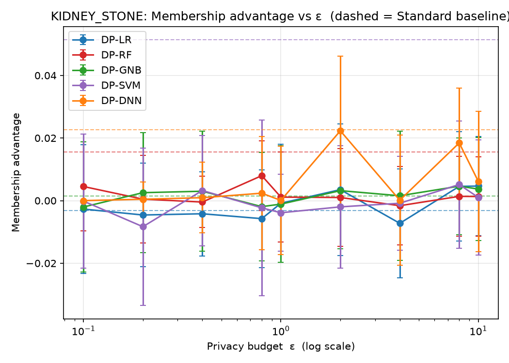
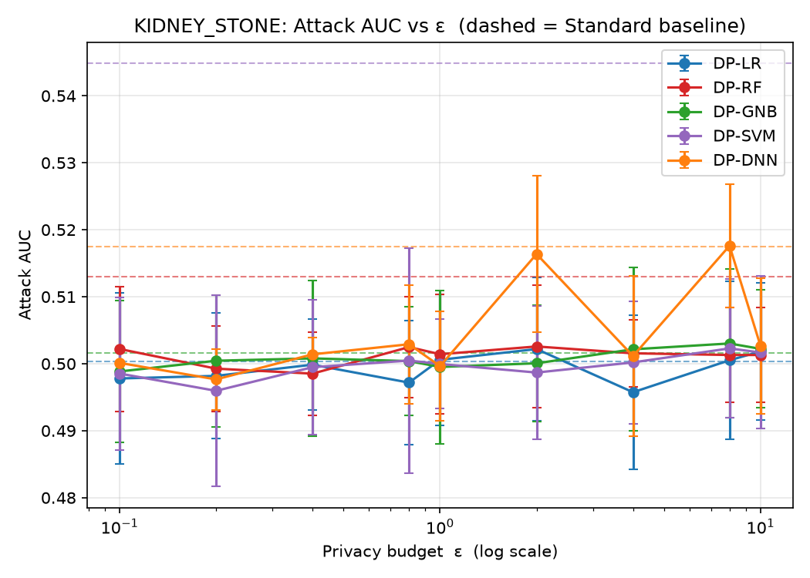
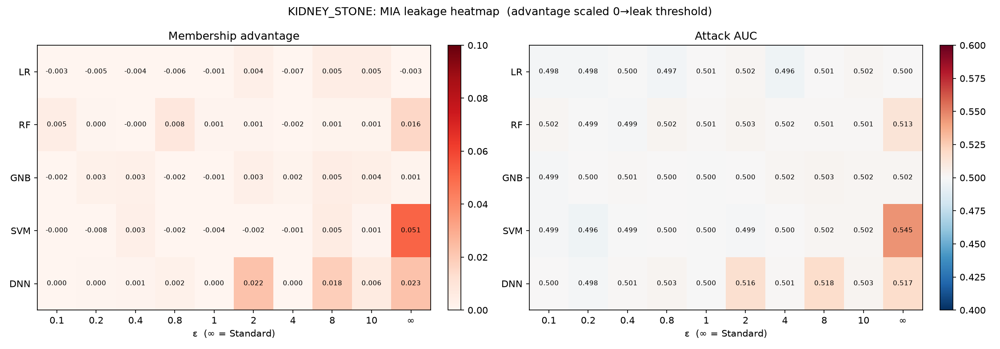
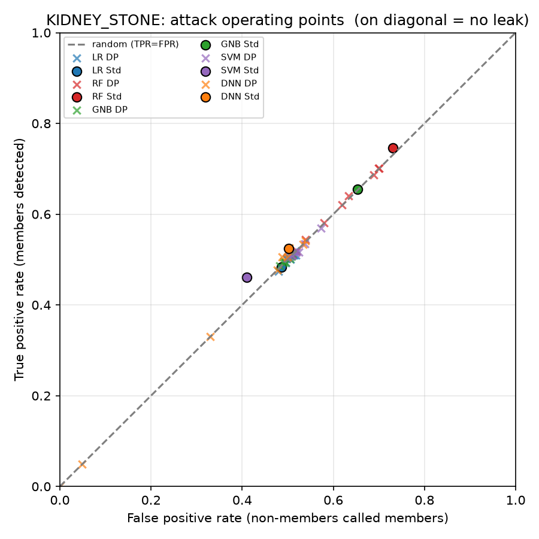
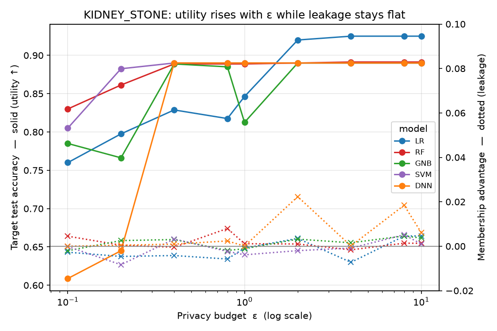
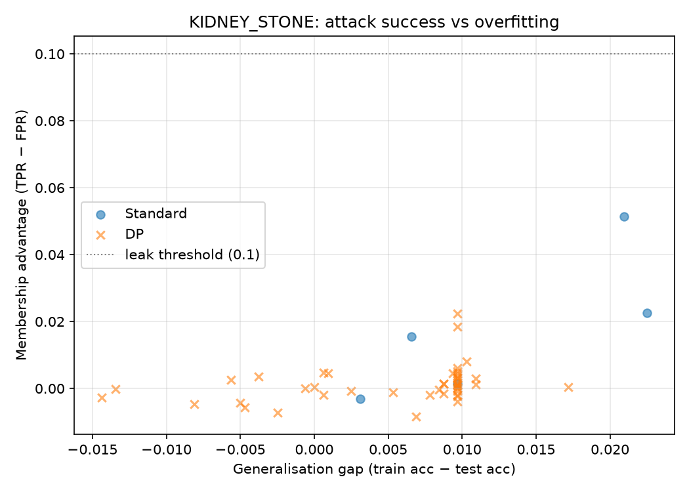
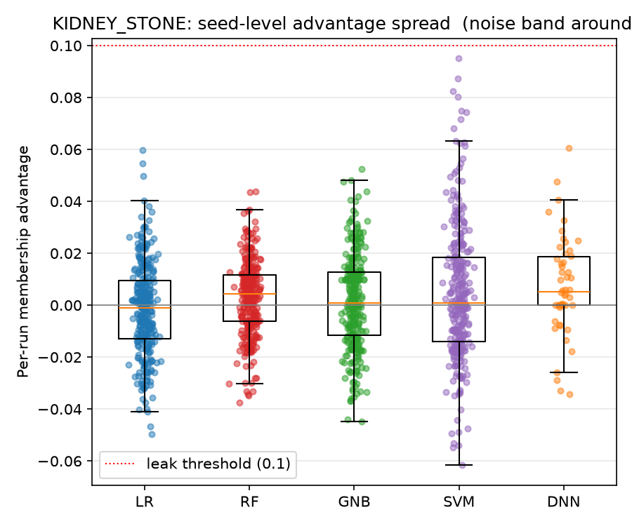
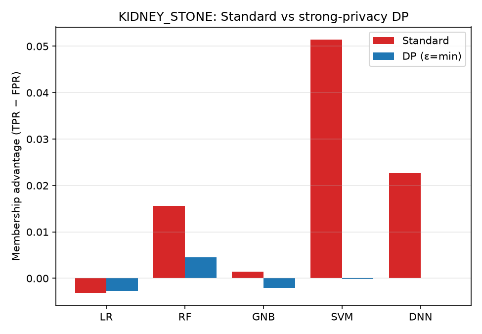

# KIDNEY_STONE — Membership Inference Attack (Shokri) Analysis

*Auto-generated by `run_mia.py` → `report.py`. Raw numbers: `KIDNEY_STONE_results.csv`.*

Shokri et al. (2017) shadow-model Membership Inference Attack (arXiv:1610.05820),
run against the **exported** targets in `KIDNEY_STONE/<family>/output/model/`.

## 1. What the attack asks
Given only query access to a trained model, can an attacker tell whether a
specific patient's record was in the **training set**? If yes, model membership
leaks — a privacy breach. The tell-tale is the **generalisation gap**
(`train_acc − test_acc`): a model that memorises its training data reacts
differently to members vs non-members. Gap ≈ 0 ⇒ nothing to leak.

## 2. What was run for KIDNEY_STONE
| Item | Value |
|------|-------|
| Samples | N = 4,000 (3,200 train / 800 test) |
| Classes | 2 |
| Features | 23 |
| Model families | LR, RF, GNB, SVM, DNN |
| DP budgets ε | 0.1, 0.2, 0.4, 0.8, 1, 2, 4, 8, 10 |
| Targets attacked | 50 |
| Target source | exported `output/model/` (loaded, not re-trained) |

The **target** is your saved model; **shadow** models are trained fresh (inherent
to the attack). Per-family loading: LR/RF/GNB load directly; the OvR **SVM** gets
a softmax probability head and is attacked in its ‖x‖≤1 space; the **DNN** is an
opacus `GradSampleModule` with a softmax head over its logits.

## 3. How to read the metrics
| Metric | Meaning | No leak | Strong leak |
|--------|---------|---------|-------------|
| Membership advantage = TPR − FPR | better-than-coin-flip membership guess | 0.0 | > 0.1 |
| Attack AUC | ranking quality of the guess | 0.5 | > 0.6 |
| Generalisation gap = train − test | how much the model overfits (the *cause*) | 0.0 | > 0.1 |

## 4. Results
| Model | Variant | ε | Advantage | Attack AUC | Train acc | Test acc | Gen. gap |
|-------|---------|---|-----------|-----------|-----------|----------|----------|
| LR | DP | 0.1 | -0.003 | 0.498 | 0.746 | 0.760 | -0.014 |
| LR | DP | 0.2 | -0.005 | 0.498 | 0.789 | 0.797 | -0.008 |
| LR | DP | 0.4 | -0.004 | 0.500 | 0.824 | 0.829 | -0.005 |
| LR | DP | 0.8 | -0.006 | 0.497 | 0.813 | 0.817 | -0.005 |
| LR | DP | 1 | -0.001 | 0.501 | 0.849 | 0.846 | +0.003 |
| LR | DP | 2 | 0.004 | 0.502 | 0.916 | 0.920 | -0.004 |
| LR | DP | 4 | -0.007 | 0.496 | 0.922 | 0.925 | -0.003 |
| LR | DP | 8 | 0.005 | 0.501 | 0.926 | 0.925 | +0.001 |
| LR | DP | 10 | 0.005 | 0.502 | 0.926 | 0.925 | +0.001 |
| LR | Standard | ∞ | -0.003 | 0.500 | 0.926 | 0.922 | +0.003 |
| RF | DP | 0.1 | 0.005 | 0.502 | 0.839 | 0.830 | +0.009 |
| RF | DP | 0.2 | 0.000 | 0.499 | 0.878 | 0.861 | +0.017 |
| RF | DP | 0.4 | -0.000 | 0.499 | 0.897 | 0.889 | +0.008 |
| RF | DP | 0.8 | 0.008 | 0.502 | 0.899 | 0.889 | +0.010 |
| RF | DP | 1 | 0.001 | 0.501 | 0.900 | 0.889 | +0.011 |
| RF | DP | 2 | 0.001 | 0.503 | 0.900 | 0.890 | +0.010 |
| RF | DP | 4 | -0.002 | 0.502 | 0.900 | 0.891 | +0.009 |
| RF | DP | 8 | 0.001 | 0.501 | 0.900 | 0.891 | +0.009 |
| RF | DP | 10 | 0.001 | 0.501 | 0.900 | 0.891 | +0.009 |
| RF | Standard | ∞ | 0.016 | 0.513 | 0.950 | 0.944 | +0.007 |
| GNB | DP | 0.1 | -0.002 | 0.499 | 0.786 | 0.785 | +0.001 |
| GNB | DP | 0.2 | 0.003 | 0.500 | 0.761 | 0.766 | -0.006 |
| GNB | DP | 0.4 | 0.003 | 0.501 | 0.900 | 0.889 | +0.011 |
| GNB | DP | 0.8 | -0.002 | 0.500 | 0.893 | 0.885 | +0.008 |
| GNB | DP | 1 | -0.001 | 0.500 | 0.818 | 0.812 | +0.005 |
| GNB | DP | 2 | 0.003 | 0.500 | 0.900 | 0.890 | +0.010 |
| GNB | DP | 4 | 0.002 | 0.502 | 0.900 | 0.890 | +0.010 |
| GNB | DP | 8 | 0.005 | 0.503 | 0.900 | 0.890 | +0.010 |
| GNB | DP | 10 | 0.004 | 0.502 | 0.900 | 0.890 | +0.010 |
| GNB | Standard | ∞ | 0.001 | 0.502 | 0.900 | 0.890 | +0.010 |
| SVM | DP | 0.1 | -0.000 | 0.499 | 0.792 | 0.805 | -0.013 |
| SVM | DP | 0.2 | -0.008 | 0.496 | 0.889 | 0.883 | +0.007 |
| SVM | DP | 0.4 | 0.003 | 0.499 | 0.900 | 0.890 | +0.010 |
| SVM | DP | 0.8 | -0.002 | 0.500 | 0.900 | 0.890 | +0.010 |
| SVM | DP | 1 | -0.004 | 0.500 | 0.900 | 0.890 | +0.010 |
| SVM | DP | 2 | -0.002 | 0.499 | 0.900 | 0.890 | +0.010 |
| SVM | DP | 4 | -0.001 | 0.500 | 0.900 | 0.890 | +0.010 |
| SVM | DP | 8 | 0.005 | 0.502 | 0.900 | 0.890 | +0.010 |
| SVM | DP | 10 | 0.001 | 0.502 | 0.900 | 0.890 | +0.010 |
| SVM | Standard | ∞ | 0.051 | 0.545 | 0.953 | 0.933 | +0.021 |
| DNN | DP | 0.1 | 0.000 | 0.500 | 0.608 | 0.609 | -0.001 |
| DNN | DP | 0.2 | 0.000 | 0.498 | 0.645 | 0.645 | +0.000 |
| DNN | DP | 0.4 | 0.001 | 0.501 | 0.900 | 0.890 | +0.010 |
| DNN | DP | 0.8 | 0.002 | 0.503 | 0.900 | 0.890 | +0.010 |
| DNN | DP | 1 | 0.000 | 0.500 | 0.900 | 0.890 | +0.010 |
| DNN | DP | 2 | 0.022 | 0.516 | 0.900 | 0.890 | +0.010 |
| DNN | DP | 4 | 0.000 | 0.501 | 0.900 | 0.890 | +0.010 |
| DNN | DP | 8 | 0.018 | 0.518 | 0.900 | 0.890 | +0.010 |
| DNN | DP | 10 | 0.006 | 0.503 | 0.900 | 0.890 | +0.010 |
| DNN | Standard | ∞ | 0.023 | 0.517 | 0.996 | 0.974 | +0.022 |

## 5. Figures
### Membership advantage vs ε



Attack advantage (TPR − FPR) for each DP model across the privacy budget; dashed lines are the non-private Standard baselines. Flat near 0 means the attacker is no better than guessing. Note the very small y-axis scale.

### Attack AUC vs ε



How well the attacker *ranks* members above non-members. 0.5 is random; every curve sits on 0.5 within its error bars, i.e. no discriminating power.

### Leakage heatmap (model × ε)



Advantage (left) and AUC (right) for every model/budget cell, including the Standard column (∞). The advantage scale runs 0 → the leak threshold, so near-white cells = no leakage; the printed numbers give the exact values.

### Attack operating points (TPR vs FPR)



Each target plotted as one (FPR, TPR) point against the random diagonal. Points sitting on the diagonal mean the attacker's hit-rate equals its false-alarm rate — the textbook signature of a failed membership attack.

### Privacy–utility–leakage trade-off



Target test accuracy (solid, left axis) versus attack advantage (dotted, right axis) as ε grows. Utility climbs while leakage stays pinned near zero — relaxing privacy here buys accuracy without creating a membership risk.

### Advantage vs generalisation gap



Membership advantage against each model's overfitting (train − test acc), with the leak threshold dotted. Points clustered at the origin show there is no overfitting to exploit — the root cause of (the absence of) leakage.

### Seed-level advantage spread



The individual seed runs behind each averaged point, grouped by model. The spread straddles zero, confirming the small non-zero means are random noise rather than a real signal.

### Standard vs strong-privacy DP



Per family, the non-private Standard advantage beside the strongest-privacy DP model (ε = min). Both bars sit near zero across all families.

Watch the y-axis scale on the ε-curves: when every point hugs advantage 0 / AUC
0.5 with error bars that cross those lines, the "wiggle" is noise, not signal.

## 6. Interpretation
**No measurable membership leakage on KIDNEY_STONE — for any model, at any ε, including the non-private Standard models.** The strongest result anywhere is advantage **0.051** (SVM Standard) and attack AUC **0.545** — both statistically indistinguishable from random guessing (advantage 0 / AUC 0.5).

The Standard models overfit (max |train − test| gap = 0.022), which is the condition under which MIA can succeed — compare the Standard vs DP bars.

## 7. Reproduce
```bash
cd Attack/MIA_Shokri
python3 run_mia.py --datasets KIDNEY_STONE
```
