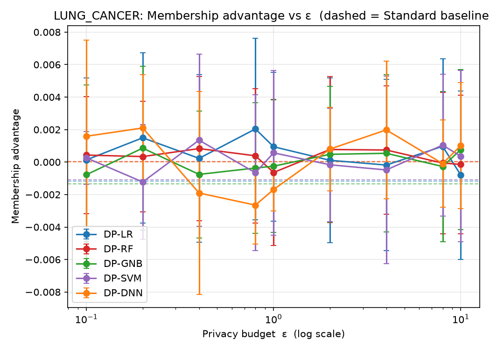
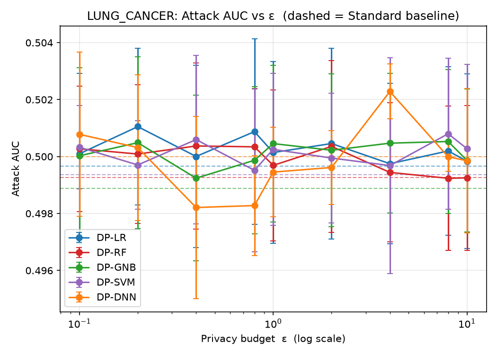
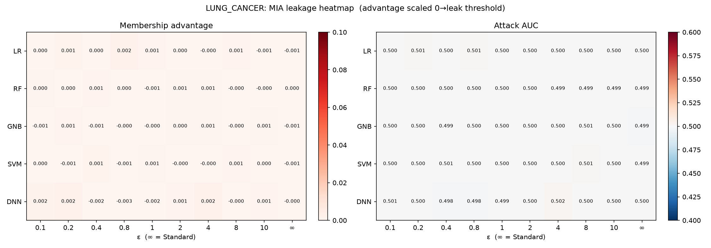
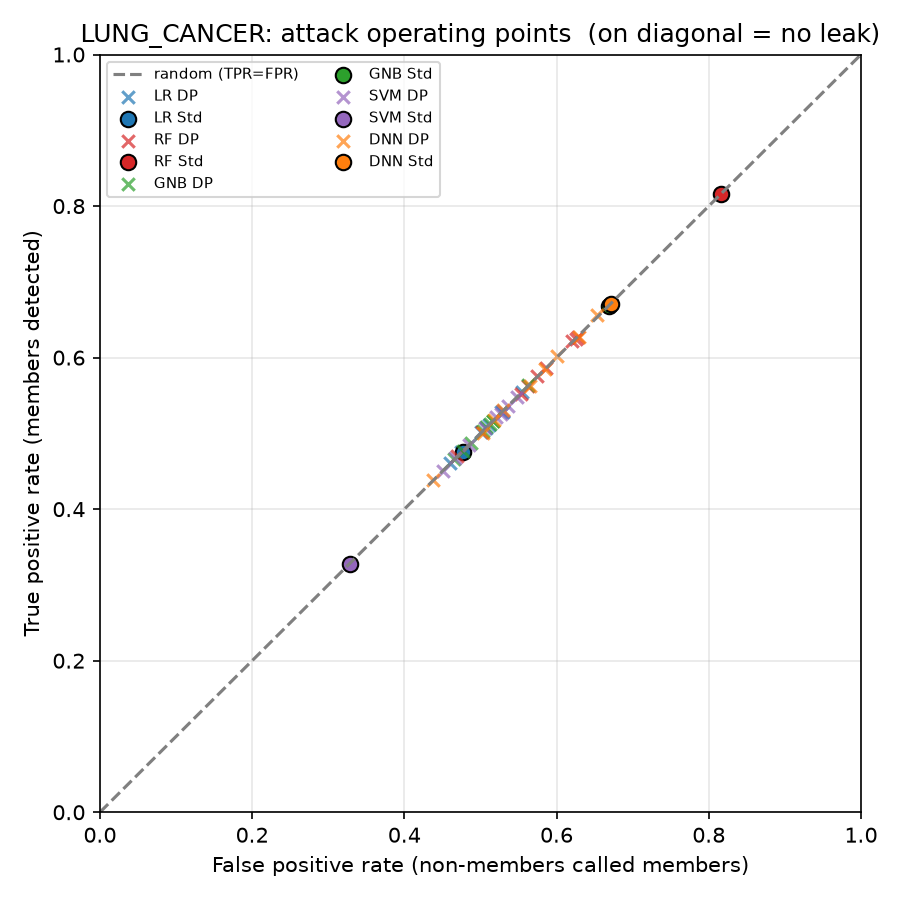
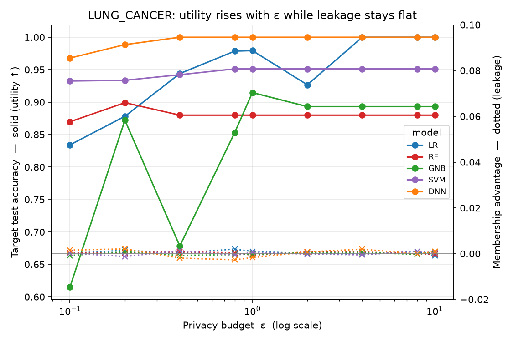
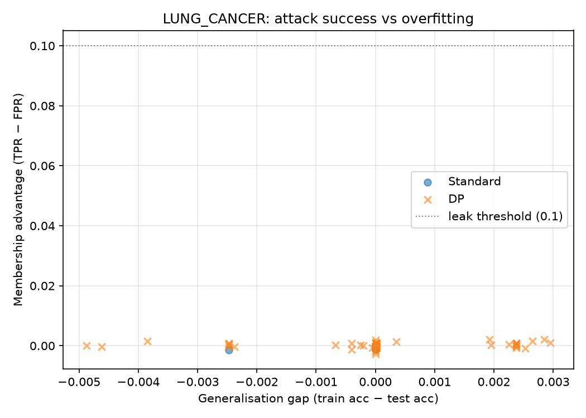
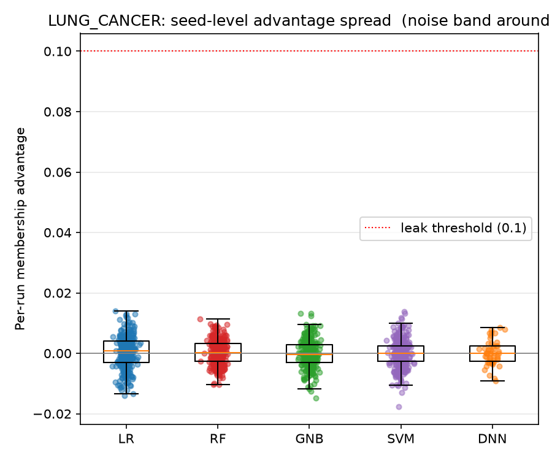
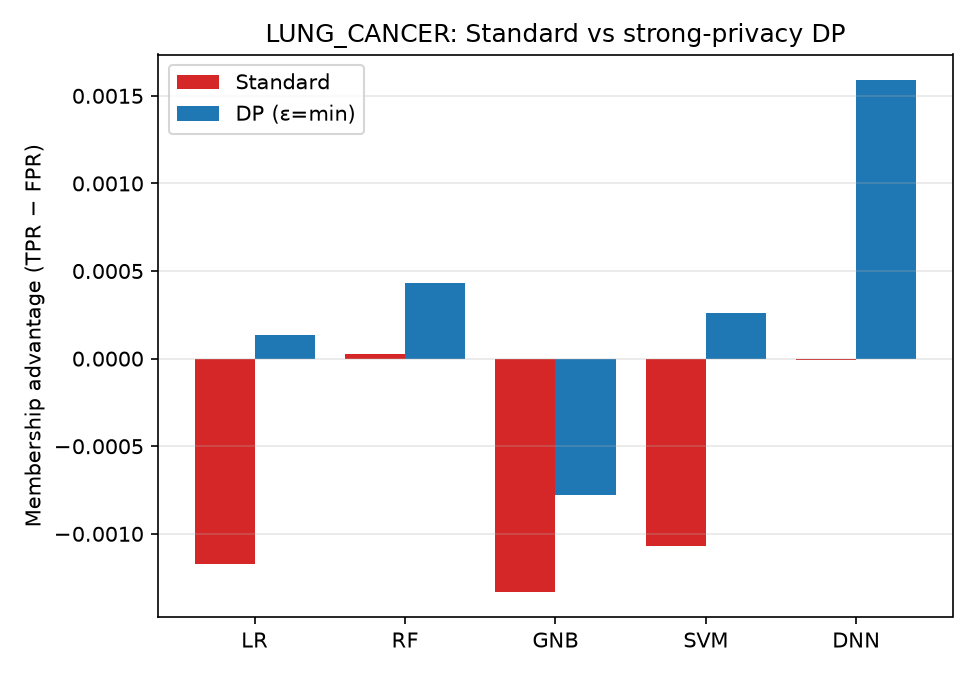

# LUNG_CANCER — Membership Inference Attack (Shokri) Analysis

*Auto-generated by `run_mia.py` → `report.py`. Raw numbers: `LUNG_CANCER_results.csv`.*

Shokri et al. (2017) shadow-model Membership Inference Attack (arXiv:1610.05820),
run against the **exported** targets in `LUNG_CANCER/<family>/output/model/`.

## 1. What the attack asks
Given only query access to a trained model, can an attacker tell whether a
specific patient's record was in the **training set**? If yes, model membership
leaks — a privacy breach. The tell-tale is the **generalisation gap**
(`train_acc − test_acc`): a model that memorises its training data reacts
differently to members vs non-members. Gap ≈ 0 ⇒ nothing to leak.

## 2. What was run for LUNG_CANCER
| Item | Value |
|------|-------|
| Samples | N = 50,000 (40,000 train / 10,000 test) |
| Classes | 3 |
| Features | 23 |
| Model families | LR, RF, GNB, SVM, DNN |
| DP budgets ε | 0.1, 0.2, 0.4, 0.8, 1, 2, 4, 8, 10 |
| Targets attacked | 50 |
| Target source | exported `output/model/` (loaded, not re-trained) |

The **target** is your saved model; **shadow** models are trained fresh (inherent
to the attack). Per-family loading: LR/RF/GNB load directly; the OvR **SVM** gets
a softmax probability head and is attacked in its ‖x‖≤1 space; the **DNN** is an
opacus `GradSampleModule` with a softmax head over its logits.

## 3. How to read the metrics
| Metric | Meaning | No leak | Strong leak |
|--------|---------|---------|-------------|
| Membership advantage = TPR − FPR | better-than-coin-flip membership guess | 0.0 | > 0.1 |
| Attack AUC | ranking quality of the guess | 0.5 | > 0.6 |
| Generalisation gap = train − test | how much the model overfits (the *cause*) | 0.0 | > 0.1 |

## 4. Results
| Model | Variant | ε | Advantage | Attack AUC | Train acc | Test acc | Gen. gap |
|-------|---------|---|-----------|-----------|-----------|----------|----------|
| LR | DP | 0.1 | 0.000 | 0.500 | 0.829 | 0.834 | -0.005 |
| LR | DP | 0.2 | 0.001 | 0.501 | 0.874 | 0.878 | -0.004 |
| LR | DP | 0.4 | 0.000 | 0.500 | 0.943 | 0.944 | -0.001 |
| LR | DP | 0.8 | 0.002 | 0.501 | 0.981 | 0.979 | +0.003 |
| LR | DP | 1 | 0.001 | 0.500 | 0.982 | 0.979 | +0.003 |
| LR | DP | 2 | 0.000 | 0.500 | 0.927 | 0.927 | -0.000 |
| LR | DP | 4 | -0.000 | 0.500 | 1.000 | 1.000 | +0.000 |
| LR | DP | 8 | 0.001 | 0.500 | 1.000 | 1.000 | +0.000 |
| LR | DP | 10 | -0.001 | 0.500 | 1.000 | 1.000 | +0.000 |
| LR | Standard | ∞ | -0.001 | 0.500 | 1.000 | 1.000 | +0.000 |
| RF | DP | 0.1 | 0.000 | 0.500 | 0.872 | 0.870 | +0.002 |
| RF | DP | 0.2 | 0.000 | 0.500 | 0.901 | 0.899 | +0.002 |
| RF | DP | 0.4 | 0.001 | 0.500 | 0.882 | 0.880 | +0.002 |
| RF | DP | 0.8 | 0.000 | 0.500 | 0.882 | 0.880 | +0.002 |
| RF | DP | 1 | -0.001 | 0.500 | 0.882 | 0.880 | +0.002 |
| RF | DP | 2 | 0.001 | 0.500 | 0.882 | 0.880 | +0.002 |
| RF | DP | 4 | 0.001 | 0.499 | 0.882 | 0.880 | +0.002 |
| RF | DP | 8 | -0.000 | 0.499 | 0.882 | 0.880 | +0.002 |
| RF | DP | 10 | -0.000 | 0.499 | 0.882 | 0.880 | +0.002 |
| RF | Standard | ∞ | 0.000 | 0.499 | 1.000 | 1.000 | +0.000 |
| GNB | DP | 0.1 | -0.001 | 0.500 | 0.618 | 0.615 | +0.003 |
| GNB | DP | 0.2 | 0.001 | 0.500 | 0.872 | 0.872 | -0.000 |
| GNB | DP | 0.4 | -0.001 | 0.499 | 0.678 | 0.678 | -0.000 |
| GNB | DP | 0.8 | -0.000 | 0.500 | 0.851 | 0.853 | -0.002 |
| GNB | DP | 1 | -0.000 | 0.500 | 0.910 | 0.915 | -0.005 |
| GNB | DP | 2 | 0.000 | 0.500 | 0.891 | 0.893 | -0.002 |
| GNB | DP | 4 | 0.001 | 0.500 | 0.891 | 0.893 | -0.002 |
| GNB | DP | 8 | -0.000 | 0.501 | 0.891 | 0.893 | -0.002 |
| GNB | DP | 10 | 0.001 | 0.500 | 0.891 | 0.893 | -0.002 |
| GNB | Standard | ∞ | -0.001 | 0.499 | 0.891 | 0.893 | -0.002 |
| SVM | DP | 0.1 | 0.000 | 0.500 | 0.932 | 0.933 | -0.000 |
| SVM | DP | 0.2 | -0.001 | 0.500 | 0.933 | 0.934 | -0.000 |
| SVM | DP | 0.4 | 0.001 | 0.501 | 0.943 | 0.942 | +0.000 |
| SVM | DP | 0.8 | -0.001 | 0.500 | 0.951 | 0.951 | +0.000 |
| SVM | DP | 1 | 0.001 | 0.500 | 0.951 | 0.951 | +0.000 |
| SVM | DP | 2 | -0.000 | 0.500 | 0.951 | 0.951 | +0.000 |
| SVM | DP | 4 | -0.000 | 0.500 | 0.951 | 0.951 | +0.000 |
| SVM | DP | 8 | 0.001 | 0.501 | 0.951 | 0.951 | +0.000 |
| SVM | DP | 10 | 0.000 | 0.500 | 0.951 | 0.951 | +0.000 |
| SVM | Standard | ∞ | -0.001 | 0.499 | 1.000 | 1.000 | +0.000 |
| DNN | DP | 0.1 | 0.002 | 0.501 | 0.971 | 0.968 | +0.003 |
| DNN | DP | 0.2 | 0.002 | 0.500 | 0.991 | 0.989 | +0.002 |
| DNN | DP | 0.4 | -0.002 | 0.498 | 1.000 | 1.000 | +0.000 |
| DNN | DP | 0.8 | -0.003 | 0.498 | 1.000 | 1.000 | +0.000 |
| DNN | DP | 1 | -0.002 | 0.499 | 1.000 | 1.000 | +0.000 |
| DNN | DP | 2 | 0.001 | 0.500 | 1.000 | 1.000 | +0.000 |
| DNN | DP | 4 | 0.002 | 0.502 | 1.000 | 1.000 | +0.000 |
| DNN | DP | 8 | -0.000 | 0.500 | 1.000 | 1.000 | +0.000 |
| DNN | DP | 10 | 0.001 | 0.500 | 1.000 | 1.000 | +0.000 |
| DNN | Standard | ∞ | -0.000 | 0.500 | 1.000 | 1.000 | +0.000 |

## 5. Figures
### Membership advantage vs ε



Attack advantage (TPR − FPR) for each DP model across the privacy budget; dashed lines are the non-private Standard baselines. Flat near 0 means the attacker is no better than guessing. Note the very small y-axis scale.

### Attack AUC vs ε



How well the attacker *ranks* members above non-members. 0.5 is random; every curve sits on 0.5 within its error bars, i.e. no discriminating power.

### Leakage heatmap (model × ε)



Advantage (left) and AUC (right) for every model/budget cell, including the Standard column (∞). The advantage scale runs 0 → the leak threshold, so near-white cells = no leakage; the printed numbers give the exact values.

### Attack operating points (TPR vs FPR)



Each target plotted as one (FPR, TPR) point against the random diagonal. Points sitting on the diagonal mean the attacker's hit-rate equals its false-alarm rate — the textbook signature of a failed membership attack.

### Privacy–utility–leakage trade-off



Target test accuracy (solid, left axis) versus attack advantage (dotted, right axis) as ε grows. Utility climbs while leakage stays pinned near zero — relaxing privacy here buys accuracy without creating a membership risk.

### Advantage vs generalisation gap



Membership advantage against each model's overfitting (train − test acc), with the leak threshold dotted. Points clustered at the origin show there is no overfitting to exploit — the root cause of (the absence of) leakage.

### Seed-level advantage spread



The individual seed runs behind each averaged point, grouped by model. The spread straddles zero, confirming the small non-zero means are random noise rather than a real signal.

### Standard vs strong-privacy DP



Per family, the non-private Standard advantage beside the strongest-privacy DP model (ε = min). Both bars sit near zero across all families.

Watch the y-axis scale on the ε-curves: when every point hugs advantage 0 / AUC
0.5 with error bars that cross those lines, the "wiggle" is noise, not signal.

## 6. Interpretation
**No measurable membership leakage on LUNG_CANCER — for any model, at any ε, including the non-private Standard models.** The strongest result anywhere is advantage **0.002** (DNN DP ε=0.2) and attack AUC **0.502** — both statistically indistinguishable from random guessing (advantage 0 / AUC 0.5).

**Important caveat:** the Standard models show an almost-zero generalisation gap (max |train − test| = 0.002). The dataset is large/separable enough that members and non-members behave identically, so there is little to no membership signal *at the source*. Read a clean result here as **"there was nothing to steal"**, not "DP defeated a strong attack."

## 7. Reproduce
```bash
cd Attack/MIA_Shokri
python3 run_mia.py --datasets LUNG_CANCER
```
