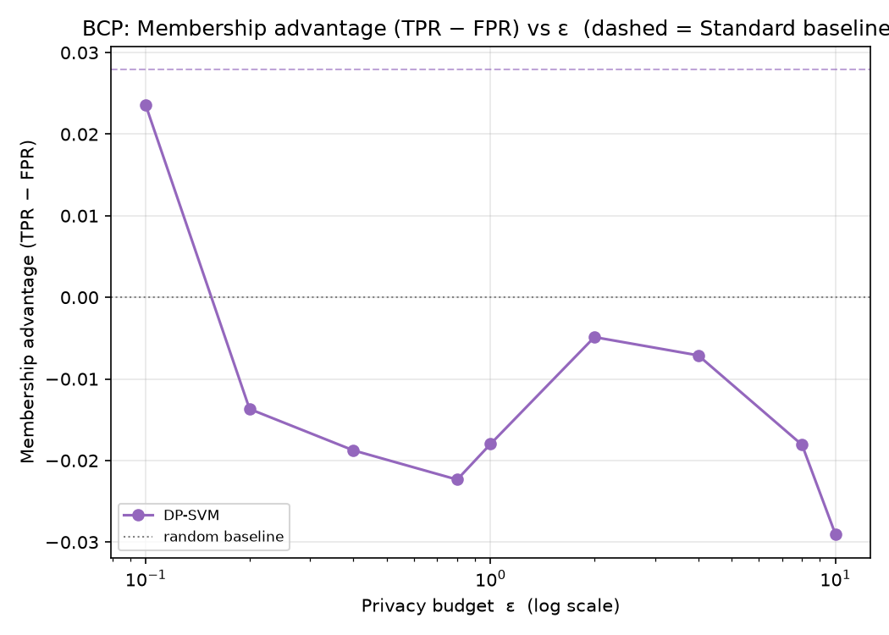
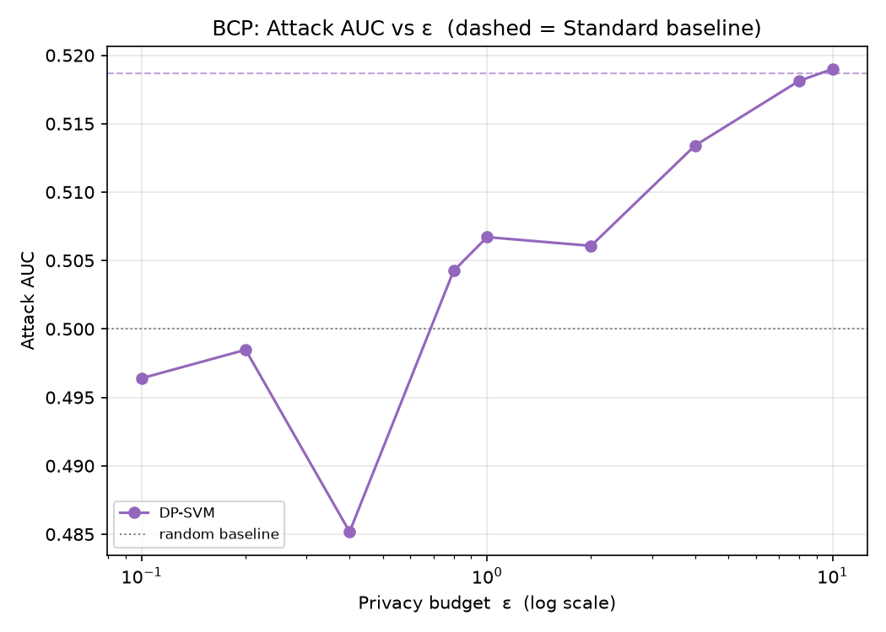
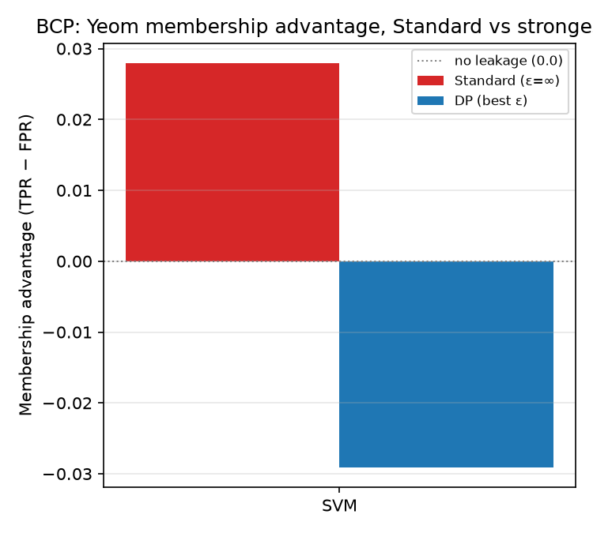
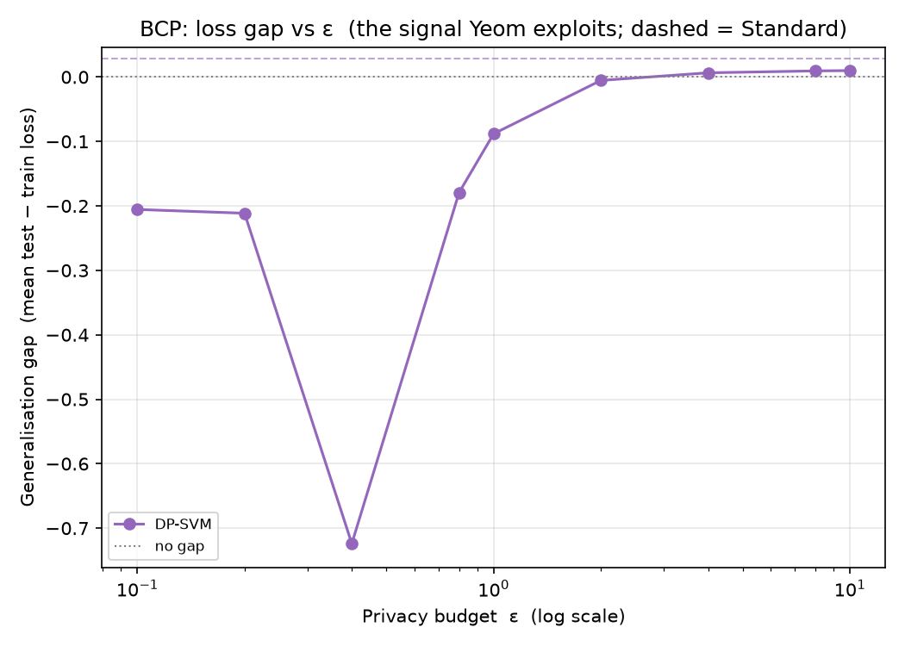

# BCP — Yeom MIA (loss-threshold) Analysis

*Auto-generated by `run_mia.py`. Raw numbers: `BCP_mia_results.csv`.*

Yeom, Giacomelli, Fredrikson, Jha (2018), *Privacy Risk in Machine Learning* (IEEE CSF) — run against the **exported** targets in `BCP/<family>/output/model/`.

## 1. Why Yeom, alongside LiRA
Yeom's attack is the **average-case** view: one global loss threshold τ (the mean training loss) applied to every record, scoring a model by the membership advantage TPR − FPR. It is the natural companion to the per-example LiRA (`Attack/LiRA`), which surfaces the *worst-case* records via TPR at a low fixed FPR. The leakage Yeom measures is driven by the model's generalisation gap, so the loss-gap figure is included as a mechanism plot.

## 2. What was run
| Item | Value |
|------|-------|
| Samples | N = 569 (455 train / 114 test) |
| Classes | 2 |
| Features | 30 |
| DP budgets ε | 0.1, 0.2, 0.4, 0.8, 1, 2, 4, 8, 10 |
| Membership ground truth | record ∈ target's training set (X_train) |
| Per-sample signal | true-class cross-entropy −log p_true |
| Rule | predict IN if loss ≤ τ = mean training loss |

## 3. How to read it
| Metric | Meaning | No leak | Leak |
|--------|---------|---------|------|
| Advantage | TPR − FPR at τ (Yeom headline) | 0.0 | > 0.1 |
| Attack AUC | average-case ranking quality | 0.5 | > 0.6 |
| Loss gap | mean(test loss) − mean(train loss) | 0.0 | ≫ 0.0 |

## 4. Results
| Model | Variant | ε | Advantage | AUC | TPR | FPR | Loss gap | Test acc |
|-------|---------|---|-----------|-----|-----|-----|----------|----------|
| SVM | Standard | ∞ | 0.028 | 0.519 | 0.738 | 0.711 | 0.028 | 0.947 |
| SVM | DP | 0.1 | 0.024 | 0.496 | 0.734 | 0.711 | -0.206 | 0.667 |
| SVM | DP | 0.2 | -0.014 | 0.498 | 0.758 | 0.772 | -0.211 | 0.693 |
| SVM | DP | 0.4 | -0.019 | 0.485 | 0.446 | 0.465 | -0.724 | 0.456 |
| SVM | DP | 0.8 | -0.022 | 0.504 | 0.811 | 0.833 | -0.179 | 0.816 |
| SVM | DP | 1 | -0.018 | 0.507 | 0.807 | 0.825 | -0.088 | 0.868 |
| SVM | DP | 2 | -0.005 | 0.506 | 0.776 | 0.781 | -0.005 | 0.886 |
| SVM | DP | 4 | -0.007 | 0.513 | 0.756 | 0.763 | 0.006 | 0.895 |
| SVM | DP | 8 | -0.018 | 0.518 | 0.754 | 0.772 | 0.009 | 0.904 |
| SVM | DP | 10 | -0.029 | 0.519 | 0.752 | 0.781 | 0.010 | 0.904 |

## 5. Figures
### Membership advantage vs ε



Yeom advantage for each DP model across the budget; dashed = Standard baseline, dotted = no-leakage (0.0). Lower is more private.

### Attack AUC vs ε



Average-case ranking quality; 0.5 is random.

### Advantage: Standard vs strong DP



Per family, non-private vs strongest-privacy DP membership advantage.

### Generalisation gap vs ε



The signal Yeom exploits: test − train loss. DP shrinks the gap, which is why it suppresses the advantage.

## 6. Interpretation
Strongest average-case leakage among the **Standard** models: **SVM** at advantage = **0.028** (AUC 0.519), vs the 0.0 no-leakage baseline.

Under DP, the worst case drops to advantage = **0.024** (SVM, ε=0.1) — quantifying the protection DP buys against the average-case attack.

> For the worst-case, per-record leakage on the same targets see the LiRA report in `Attack/LiRA/results/`.

## 7. Reproduce
```bash
cd Attack/MIA
python3 run_mia.py --datasets BCP
```