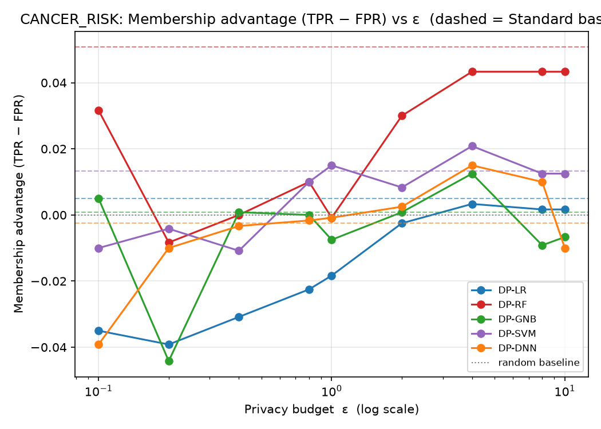
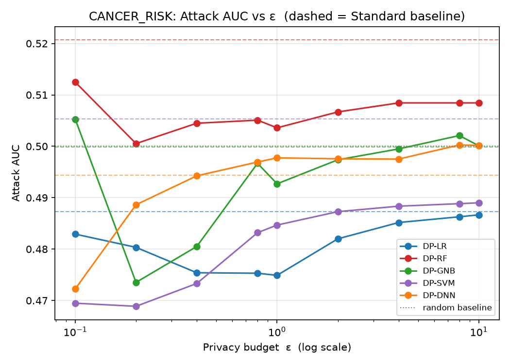
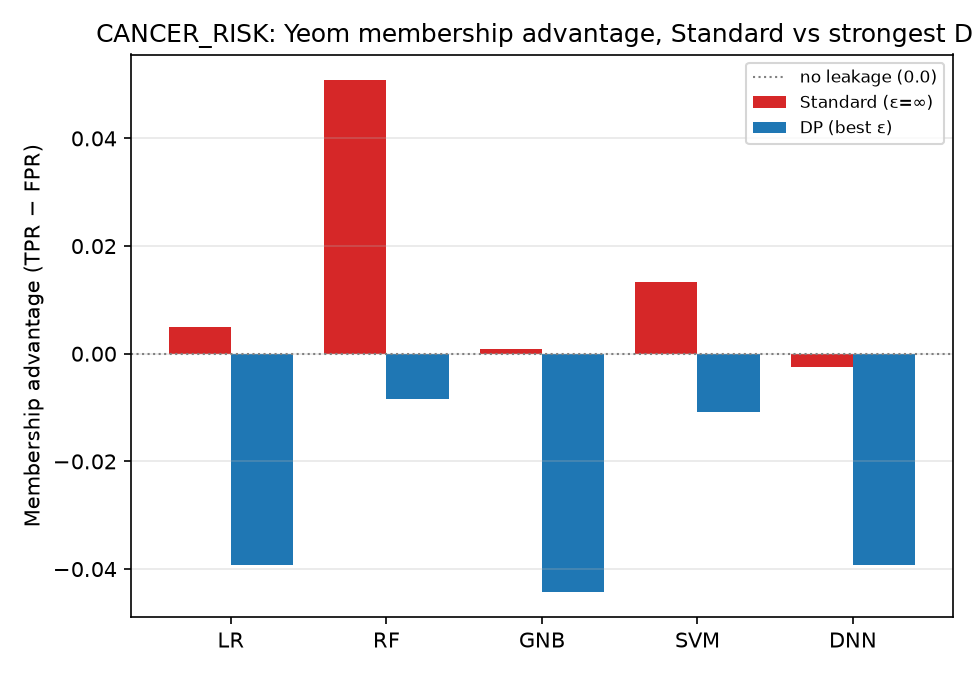
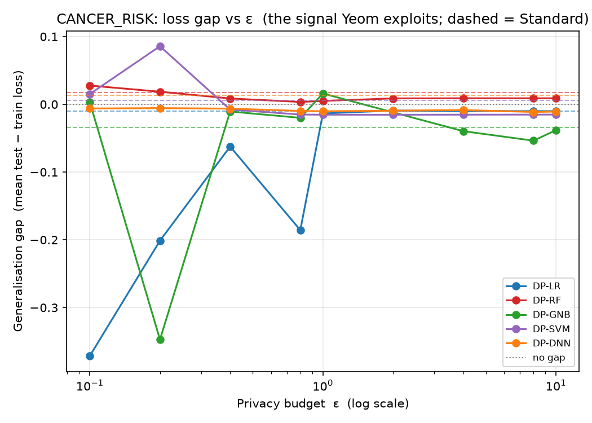

# CANCER_RISK — Yeom MIA (loss-threshold) Analysis

*Auto-generated by `run_mia.py`. Raw numbers: `CANCER_RISK_mia_results.csv`.*

Yeom, Giacomelli, Fredrikson, Jha (2018), *Privacy Risk in Machine Learning* (IEEE CSF) — run against the **exported** targets in `CANCER_RISK/<family>/output/model/`.

## 1. Why Yeom, alongside LiRA
Yeom's attack is the **average-case** view: one global loss threshold τ (the mean training loss) applied to every record, scoring a model by the membership advantage TPR − FPR. It is the natural companion to the per-example LiRA (`Attack/LiRA`), which surfaces the *worst-case* records via TPR at a low fixed FPR. The leakage Yeom measures is driven by the model's generalisation gap, so the loss-gap figure is included as a mechanism plot.

## 2. What was run
| Item | Value |
|------|-------|
| Samples | N = 1500 (1200 train / 300 test) |
| Classes | 2 |
| Features | 8 |
| DP budgets ε | 0.1, 0.2, 0.4, 0.8, 1, 2, 4, 8, 10 |
| Membership ground truth | record ∈ target's training set (X_train) |
| Per-sample signal | true-class cross-entropy −log p_true |
| Rule | predict IN if loss ≤ τ = mean training loss |

## 3. How to read it
| Metric | Meaning | No leak | Leak |
|--------|---------|---------|------|
| Advantage | TPR − FPR at τ (Yeom headline) | 0.0 | > 0.1 |
| Attack AUC | average-case ranking quality | 0.5 | > 0.6 |
| Loss gap | mean(test loss) − mean(train loss) | 0.0 | ≫ 0.0 |

## 4. Results
| Model | Variant | ε | Advantage | AUC | TPR | FPR | Loss gap | Test acc |
|-------|---------|---|-----------|-----|-----|-----|----------|----------|
| LR | Standard | ∞ | 0.005 | 0.487 | 0.695 | 0.690 | -0.010 | 0.850 |
| LR | DP | 0.1 | -0.035 | 0.483 | 0.728 | 0.763 | -0.371 | 0.683 |
| LR | DP | 0.2 | -0.039 | 0.480 | 0.754 | 0.793 | -0.201 | 0.743 |
| LR | DP | 0.4 | -0.031 | 0.475 | 0.762 | 0.793 | -0.062 | 0.803 |
| LR | DP | 0.8 | -0.022 | 0.475 | 0.804 | 0.827 | -0.186 | 0.793 |
| LR | DP | 1 | -0.018 | 0.475 | 0.775 | 0.793 | -0.014 | 0.843 |
| LR | DP | 2 | -0.002 | 0.482 | 0.718 | 0.720 | -0.009 | 0.847 |
| LR | DP | 4 | 0.003 | 0.485 | 0.707 | 0.703 | -0.010 | 0.850 |
| LR | DP | 8 | 0.002 | 0.486 | 0.698 | 0.697 | -0.010 | 0.850 |
| LR | DP | 10 | 0.002 | 0.487 | 0.698 | 0.697 | -0.010 | 0.850 |
| RF | Standard | ∞ | 0.051 | 0.521 | 0.604 | 0.553 | 0.017 | 0.850 |
| RF | DP | 0.1 | 0.032 | 0.512 | 0.635 | 0.603 | 0.028 | 0.640 |
| RF | DP | 0.2 | -0.008 | 0.501 | 0.622 | 0.630 | 0.019 | 0.667 |
| RF | DP | 0.4 | 0.000 | 0.504 | 0.603 | 0.603 | 0.009 | 0.687 |
| RF | DP | 0.8 | 0.010 | 0.505 | 0.633 | 0.623 | 0.004 | 0.733 |
| RF | DP | 1 | -0.001 | 0.504 | 0.656 | 0.657 | 0.005 | 0.710 |
| RF | DP | 2 | 0.030 | 0.507 | 0.603 | 0.573 | 0.009 | 0.723 |
| RF | DP | 4 | 0.043 | 0.508 | 0.597 | 0.553 | 0.009 | 0.727 |
| RF | DP | 8 | 0.043 | 0.508 | 0.597 | 0.553 | 0.009 | 0.727 |
| RF | DP | 10 | 0.043 | 0.508 | 0.597 | 0.553 | 0.009 | 0.727 |
| GNB | Standard | ∞ | 0.001 | 0.500 | 0.801 | 0.800 | -0.034 | 0.830 |
| GNB | DP | 0.1 | 0.005 | 0.505 | 0.722 | 0.717 | 0.003 | 0.690 |
| GNB | DP | 0.2 | -0.044 | 0.474 | 0.672 | 0.717 | -0.347 | 0.540 |
| GNB | DP | 0.4 | 0.001 | 0.481 | 0.744 | 0.743 | -0.011 | 0.730 |
| GNB | DP | 0.8 | 0.000 | 0.497 | 0.740 | 0.740 | -0.020 | 0.823 |
| GNB | DP | 1 | -0.007 | 0.493 | 0.699 | 0.707 | 0.016 | 0.710 |
| GNB | DP | 2 | 0.001 | 0.497 | 0.854 | 0.853 | -0.012 | 0.780 |
| GNB | DP | 4 | 0.013 | 0.499 | 0.819 | 0.807 | -0.040 | 0.840 |
| GNB | DP | 8 | -0.009 | 0.502 | 0.848 | 0.857 | -0.054 | 0.807 |
| GNB | DP | 10 | -0.007 | 0.500 | 0.810 | 0.817 | -0.038 | 0.823 |
| SVM | Standard | ∞ | 0.013 | 0.505 | 0.790 | 0.777 | 0.006 | 0.883 |
| SVM | DP | 0.1 | -0.010 | 0.469 | 0.750 | 0.760 | 0.015 | 0.727 |
| SVM | DP | 0.2 | -0.004 | 0.469 | 0.749 | 0.753 | 0.086 | 0.710 |
| SVM | DP | 0.4 | -0.011 | 0.473 | 0.743 | 0.753 | -0.008 | 0.813 |
| SVM | DP | 0.8 | 0.010 | 0.483 | 0.727 | 0.717 | -0.015 | 0.843 |
| SVM | DP | 1 | 0.015 | 0.485 | 0.728 | 0.713 | -0.015 | 0.843 |
| SVM | DP | 2 | 0.008 | 0.487 | 0.722 | 0.713 | -0.015 | 0.847 |
| SVM | DP | 4 | 0.021 | 0.488 | 0.724 | 0.703 | -0.015 | 0.850 |
| SVM | DP | 8 | 0.012 | 0.489 | 0.719 | 0.707 | -0.015 | 0.850 |
| SVM | DP | 10 | 0.012 | 0.489 | 0.719 | 0.707 | -0.015 | 0.850 |
| DNN | Standard | ∞ | -0.002 | 0.494 | 0.794 | 0.797 | 0.013 | 0.890 |
| DNN | DP | 0.1 | -0.039 | 0.472 | 0.511 | 0.550 | -0.006 | 0.590 |
| DNN | DP | 0.2 | -0.010 | 0.489 | 0.553 | 0.563 | -0.006 | 0.670 |
| DNN | DP | 0.4 | -0.003 | 0.494 | 0.627 | 0.630 | -0.006 | 0.637 |
| DNN | DP | 0.8 | -0.002 | 0.497 | 0.628 | 0.630 | -0.010 | 0.630 |
| DNN | DP | 1 | -0.001 | 0.498 | 0.629 | 0.630 | -0.010 | 0.630 |
| DNN | DP | 2 | 0.003 | 0.498 | 0.666 | 0.663 | -0.009 | 0.663 |
| DNN | DP | 4 | 0.015 | 0.498 | 0.712 | 0.697 | -0.008 | 0.737 |
| DNN | DP | 8 | 0.010 | 0.500 | 0.780 | 0.770 | -0.011 | 0.823 |
| DNN | DP | 10 | -0.010 | 0.500 | 0.787 | 0.797 | -0.011 | 0.830 |

## 5. Figures
### Membership advantage vs ε



Yeom advantage for each DP model across the budget; dashed = Standard baseline, dotted = no-leakage (0.0). Lower is more private.

### Attack AUC vs ε



Average-case ranking quality; 0.5 is random.

### Advantage: Standard vs strong DP



Per family, non-private vs strongest-privacy DP membership advantage.

### Generalisation gap vs ε



The signal Yeom exploits: test − train loss. DP shrinks the gap, which is why it suppresses the advantage.

## 6. Interpretation
Strongest average-case leakage among the **Standard** models: **RF** at advantage = **0.051** (AUC 0.521), vs the 0.0 no-leakage baseline.

Under DP, the worst case drops to advantage = **0.043** (RF, ε=4) — quantifying the protection DP buys against the average-case attack.

> For the worst-case, per-record leakage on the same targets see the LiRA report in `Attack/LiRA/results/`.

## 7. Reproduce
```bash
cd Attack/MIA
python3 run_mia.py --datasets CANCER_RISK
```