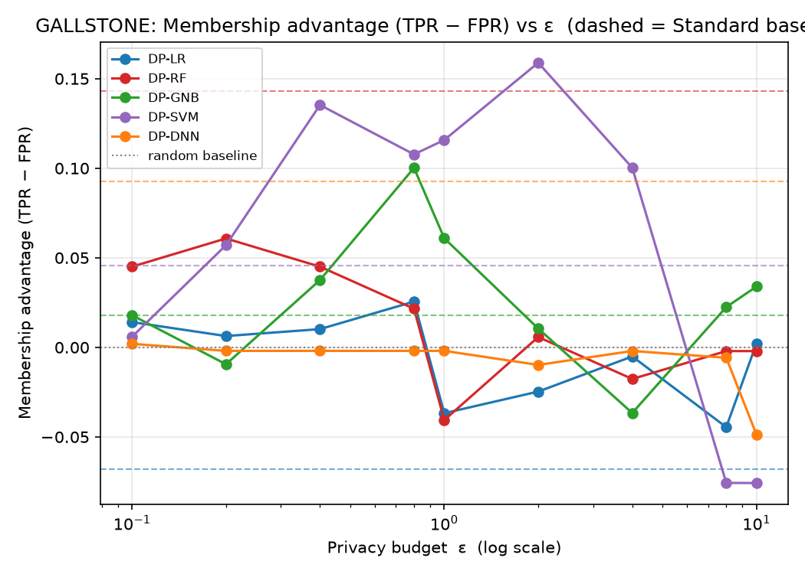
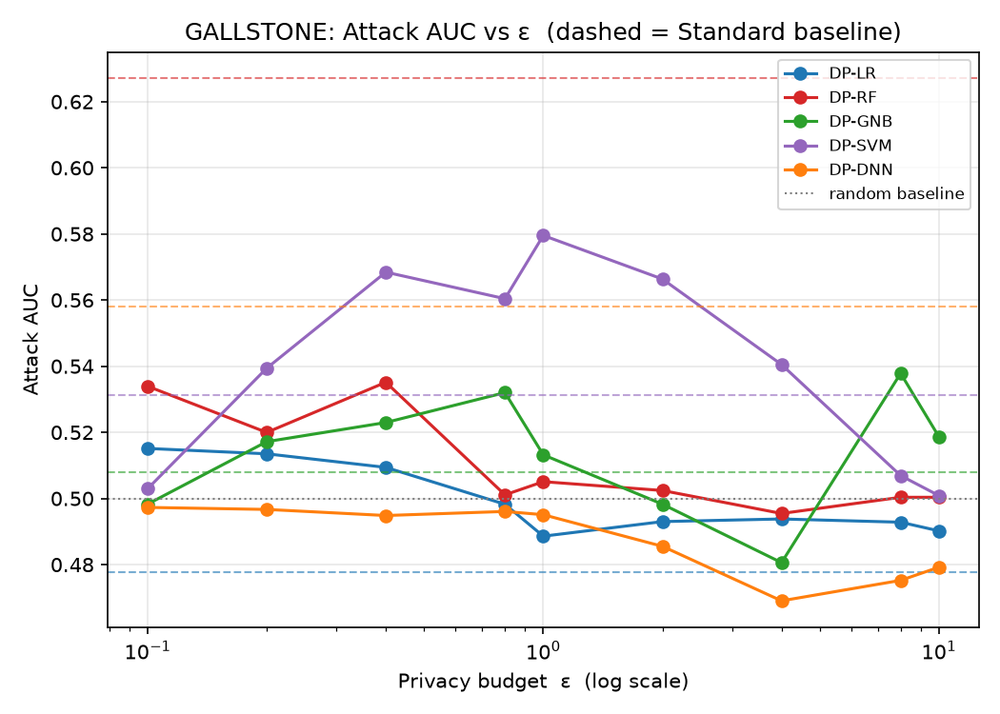
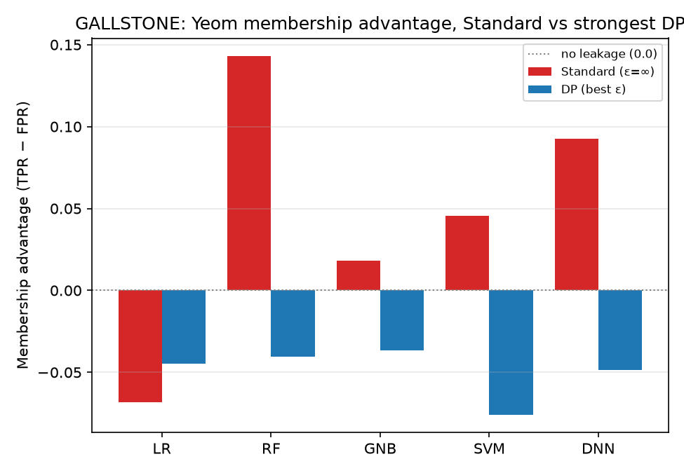
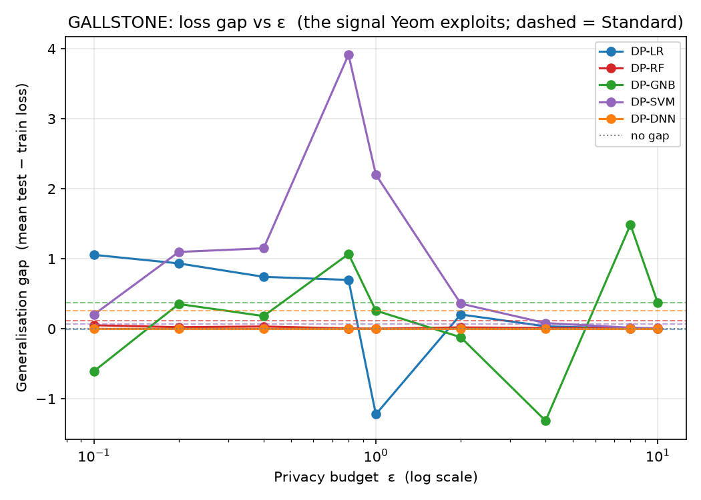

# GALLSTONE — Yeom MIA (loss-threshold) Analysis

*Auto-generated by `run_mia.py`. Raw numbers: `GALLSTONE_mia_results.csv`.*

Yeom, Giacomelli, Fredrikson, Jha (2018), *Privacy Risk in Machine Learning* (IEEE CSF) — run against the **exported** targets in `GALLSTONE/<family>/output/model/`.

## 1. Why Yeom, alongside LiRA
Yeom's attack is the **average-case** view: one global loss threshold τ (the mean training loss) applied to every record, scoring a model by the membership advantage TPR − FPR. It is the natural companion to the per-example LiRA (`Attack/LiRA`), which surfaces the *worst-case* records via TPR at a low fixed FPR. The leakage Yeom measures is driven by the model's generalisation gap, so the loss-gap figure is included as a mechanism plot.

## 2. What was run
| Item | Value |
|------|-------|
| Samples | N = 319 (255 train / 64 test) |
| Classes | 2 |
| Features | 38 |
| DP budgets ε | 0.1, 0.2, 0.4, 0.8, 1, 2, 4, 8, 10 |
| Membership ground truth | record ∈ target's training set (X_train) |
| Per-sample signal | true-class cross-entropy −log p_true |
| Rule | predict IN if loss ≤ τ = mean training loss |

## 3. How to read it
| Metric | Meaning | No leak | Leak |
|--------|---------|---------|------|
| Advantage | TPR − FPR at τ (Yeom headline) | 0.0 | > 0.1 |
| Attack AUC | average-case ranking quality | 0.5 | > 0.6 |
| Loss gap | mean(test loss) − mean(train loss) | 0.0 | ≫ 0.0 |

## 4. Results
| Model | Variant | ε | Advantage | AUC | TPR | FPR | Loss gap | Test acc |
|-------|---------|---|-----------|-----|-----|-----|----------|----------|
| LR | Standard | ∞ | -0.068 | 0.478 | 0.541 | 0.609 | -0.007 | 0.766 |
| LR | DP | 0.1 | 0.014 | 0.515 | 0.608 | 0.594 | 1.056 | 0.484 |
| LR | DP | 0.2 | 0.006 | 0.514 | 0.616 | 0.609 | 0.934 | 0.484 |
| LR | DP | 0.4 | 0.010 | 0.509 | 0.604 | 0.594 | 0.742 | 0.500 |
| LR | DP | 0.8 | 0.026 | 0.498 | 0.541 | 0.516 | 0.698 | 0.438 |
| LR | DP | 1 | -0.037 | 0.489 | 0.588 | 0.625 | -1.222 | 0.516 |
| LR | DP | 2 | -0.025 | 0.493 | 0.678 | 0.703 | 0.204 | 0.484 |
| LR | DP | 4 | -0.005 | 0.494 | 0.698 | 0.703 | 0.035 | 0.609 |
| LR | DP | 8 | -0.045 | 0.493 | 0.596 | 0.641 | 0.004 | 0.641 |
| LR | DP | 10 | 0.002 | 0.490 | 0.580 | 0.578 | 0.000 | 0.656 |
| RF | Standard | ∞ | 0.143 | 0.627 | 0.612 | 0.469 | 0.115 | 0.828 |
| RF | DP | 0.1 | 0.045 | 0.534 | 0.529 | 0.484 | 0.051 | 0.484 |
| RF | DP | 0.2 | 0.061 | 0.520 | 0.561 | 0.500 | 0.023 | 0.500 |
| RF | DP | 0.4 | 0.045 | 0.535 | 0.529 | 0.484 | 0.033 | 0.484 |
| RF | DP | 0.8 | 0.022 | 0.501 | 0.522 | 0.500 | 0.005 | 0.500 |
| RF | DP | 1 | -0.041 | 0.505 | 0.600 | 0.641 | 0.002 | 0.594 |
| RF | DP | 2 | 0.006 | 0.502 | 0.475 | 0.469 | 0.019 | 0.547 |
| RF | DP | 4 | -0.018 | 0.495 | 0.482 | 0.500 | 0.012 | 0.578 |
| RF | DP | 8 | -0.002 | 0.500 | 0.467 | 0.469 | 0.007 | 0.547 |
| RF | DP | 10 | -0.002 | 0.500 | 0.467 | 0.469 | 0.007 | 0.547 |
| GNB | Standard | ∞ | 0.018 | 0.508 | 0.612 | 0.594 | 0.374 | 0.547 |
| GNB | DP | 0.1 | 0.018 | 0.498 | 0.596 | 0.578 | -0.607 | 0.531 |
| GNB | DP | 0.2 | -0.009 | 0.517 | 0.584 | 0.594 | 0.354 | 0.500 |
| GNB | DP | 0.4 | 0.038 | 0.523 | 0.616 | 0.578 | 0.182 | 0.469 |
| GNB | DP | 0.8 | 0.100 | 0.532 | 0.647 | 0.547 | 1.068 | 0.453 |
| GNB | DP | 1 | 0.061 | 0.513 | 0.592 | 0.531 | 0.260 | 0.516 |
| GNB | DP | 2 | 0.010 | 0.498 | 0.682 | 0.672 | -0.121 | 0.516 |
| GNB | DP | 4 | -0.037 | 0.481 | 0.620 | 0.656 | -1.314 | 0.531 |
| GNB | DP | 8 | 0.022 | 0.538 | 0.757 | 0.734 | 1.487 | 0.469 |
| GNB | DP | 10 | 0.034 | 0.519 | 0.690 | 0.656 | 0.369 | 0.578 |
| SVM | Standard | ∞ | 0.046 | 0.531 | 0.686 | 0.641 | 0.070 | 0.781 |
| SVM | DP | 0.1 | 0.006 | 0.503 | 0.506 | 0.500 | 0.203 | 0.500 |
| SVM | DP | 0.2 | 0.057 | 0.539 | 0.604 | 0.547 | 1.098 | 0.469 |
| SVM | DP | 0.4 | 0.135 | 0.568 | 0.635 | 0.500 | 1.150 | 0.406 |
| SVM | DP | 0.8 | 0.108 | 0.560 | 0.576 | 0.469 | 3.916 | 0.375 |
| SVM | DP | 1 | 0.116 | 0.580 | 0.631 | 0.516 | 2.202 | 0.359 |
| SVM | DP | 2 | 0.159 | 0.566 | 0.675 | 0.516 | 0.359 | 0.469 |
| SVM | DP | 4 | 0.100 | 0.541 | 0.663 | 0.562 | 0.081 | 0.594 |
| SVM | DP | 8 | -0.076 | 0.507 | 0.627 | 0.703 | 0.016 | 0.734 |
| SVM | DP | 10 | -0.076 | 0.501 | 0.612 | 0.688 | 0.006 | 0.750 |
| DNN | Standard | ∞ | 0.092 | 0.558 | 0.671 | 0.578 | 0.262 | 0.781 |
| DNN | DP | 0.1 | 0.002 | 0.497 | 0.502 | 0.500 | -0.001 | 0.500 |
| DNN | DP | 0.2 | -0.002 | 0.497 | 0.498 | 0.500 | -0.001 | 0.500 |
| DNN | DP | 0.4 | -0.002 | 0.495 | 0.498 | 0.500 | -0.001 | 0.500 |
| DNN | DP | 0.8 | -0.002 | 0.496 | 0.498 | 0.500 | -0.001 | 0.500 |
| DNN | DP | 1 | -0.002 | 0.495 | 0.498 | 0.500 | -0.001 | 0.500 |
| DNN | DP | 2 | -0.010 | 0.486 | 0.490 | 0.500 | -0.001 | 0.500 |
| DNN | DP | 4 | -0.002 | 0.469 | 0.482 | 0.484 | -0.002 | 0.688 |
| DNN | DP | 8 | -0.006 | 0.475 | 0.510 | 0.516 | -0.002 | 0.656 |
| DNN | DP | 10 | -0.049 | 0.479 | 0.514 | 0.562 | -0.003 | 0.656 |

## 5. Figures
### Membership advantage vs ε



Yeom advantage for each DP model across the budget; dashed = Standard baseline, dotted = no-leakage (0.0). Lower is more private.

### Attack AUC vs ε



Average-case ranking quality; 0.5 is random.

### Advantage: Standard vs strong DP



Per family, non-private vs strongest-privacy DP membership advantage.

### Generalisation gap vs ε



The signal Yeom exploits: test − train loss. DP shrinks the gap, which is why it suppresses the advantage.

## 6. Interpretation
Strongest average-case leakage among the **Standard** models: **RF** at advantage = **0.143** (AUC 0.627), vs the 0.0 no-leakage baseline.

Under DP, the worst case drops to advantage = **0.159** (SVM, ε=2) — quantifying the protection DP buys against the average-case attack.

> For the worst-case, per-record leakage on the same targets see the LiRA report in `Attack/LiRA/results/`.

## 7. Reproduce
```bash
cd Attack/MIA
python3 run_mia.py --datasets GALLSTONE
```