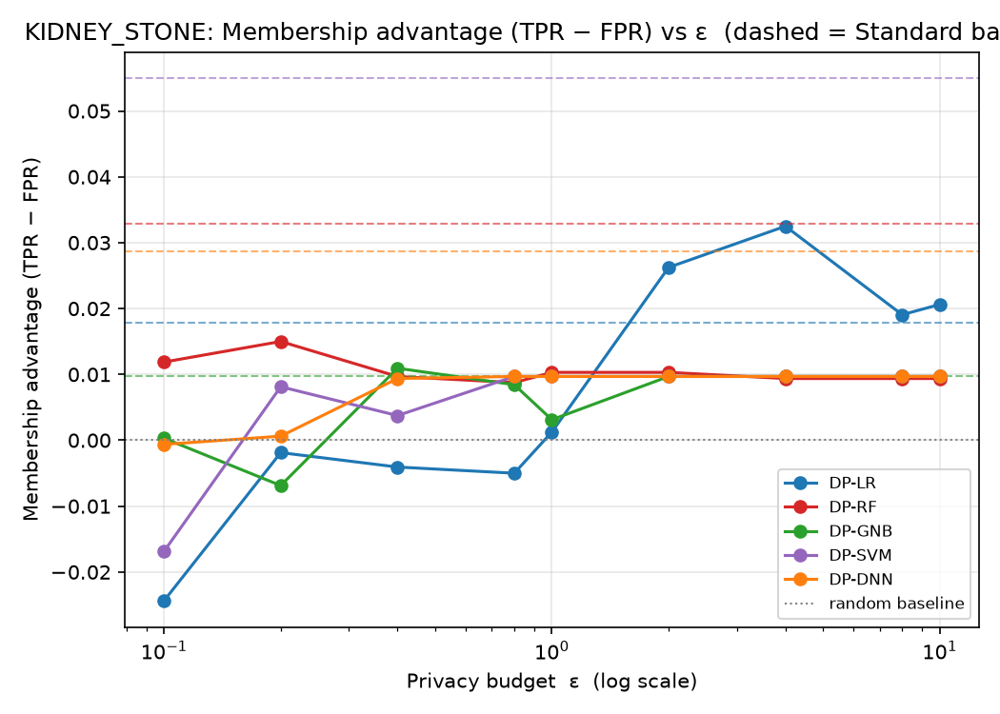
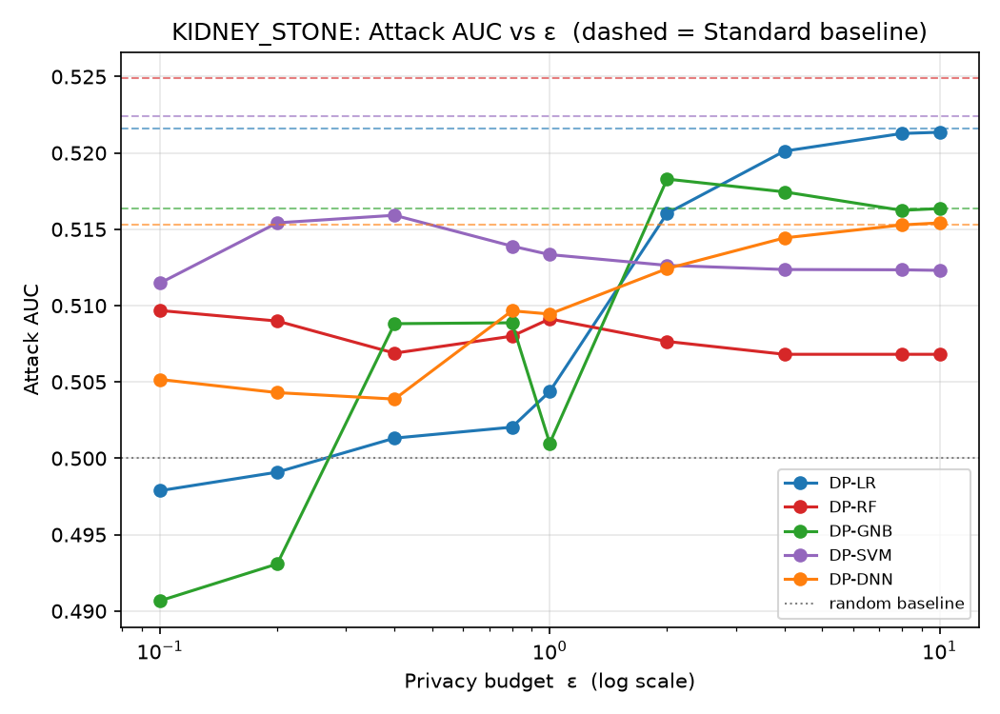
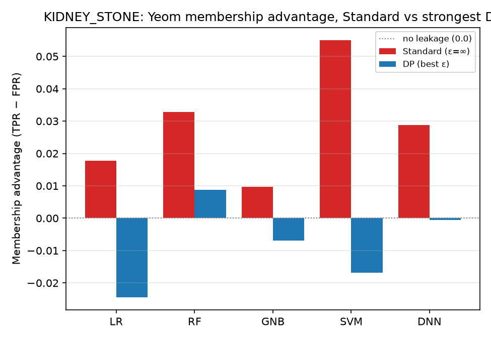
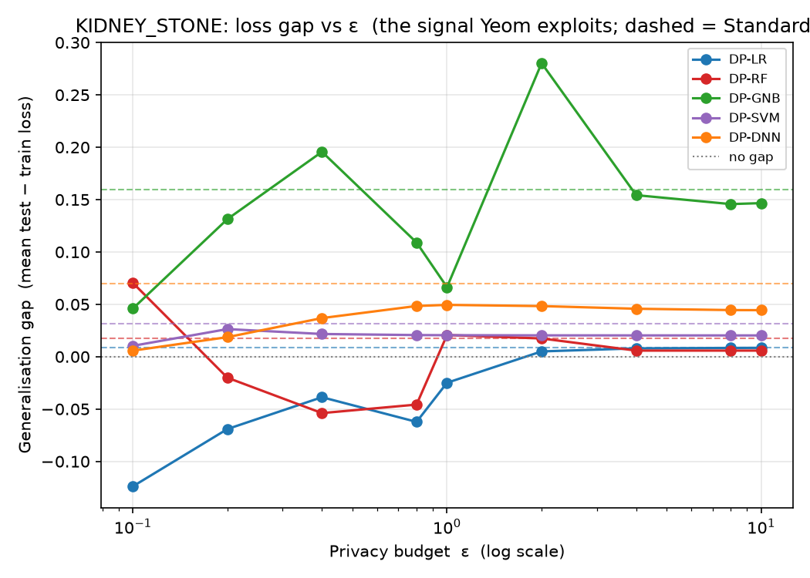

# KIDNEY_STONE — Yeom MIA (loss-threshold) Analysis

*Auto-generated by `run_mia.py`. Raw numbers: `KIDNEY_STONE_mia_results.csv`.*

Yeom, Giacomelli, Fredrikson, Jha (2018), *Privacy Risk in Machine Learning* (IEEE CSF) — run against the **exported** targets in `KIDNEY_STONE/<family>/output/model/`.

## 1. Why Yeom, alongside LiRA
Yeom's attack is the **average-case** view: one global loss threshold τ (the mean training loss) applied to every record, scoring a model by the membership advantage TPR − FPR. It is the natural companion to the per-example LiRA (`Attack/LiRA`), which surfaces the *worst-case* records via TPR at a low fixed FPR. The leakage Yeom measures is driven by the model's generalisation gap, so the loss-gap figure is included as a mechanism plot.

## 2. What was run
| Item | Value |
|------|-------|
| Samples | N = 4000 (3200 train / 800 test) |
| Classes | 2 |
| Features | 23 |
| DP budgets ε | 0.1, 0.2, 0.4, 0.8, 1, 2, 4, 8, 10 |
| Membership ground truth | record ∈ target's training set (X_train) |
| Per-sample signal | true-class cross-entropy −log p_true |
| Rule | predict IN if loss ≤ τ = mean training loss |

## 3. How to read it
| Metric | Meaning | No leak | Leak |
|--------|---------|---------|------|
| Advantage | TPR − FPR at τ (Yeom headline) | 0.0 | > 0.1 |
| Attack AUC | average-case ranking quality | 0.5 | > 0.6 |
| Loss gap | mean(test loss) − mean(train loss) | 0.0 | ≫ 0.0 |

## 4. Results
| Model | Variant | ε | Advantage | AUC | TPR | FPR | Loss gap | Test acc |
|-------|---------|---|-----------|-----|-----|-----|----------|----------|
| LR | Standard | ∞ | 0.018 | 0.522 | 0.789 | 0.771 | 0.009 | 0.922 |
| LR | DP | 0.1 | -0.024 | 0.498 | 0.788 | 0.812 | -0.124 | 0.760 |
| LR | DP | 0.2 | -0.002 | 0.499 | 0.821 | 0.823 | -0.069 | 0.797 |
| LR | DP | 0.4 | -0.004 | 0.501 | 0.835 | 0.839 | -0.039 | 0.829 |
| LR | DP | 0.8 | -0.005 | 0.502 | 0.840 | 0.845 | -0.062 | 0.818 |
| LR | DP | 1 | 0.001 | 0.504 | 0.854 | 0.853 | -0.025 | 0.846 |
| LR | DP | 2 | 0.026 | 0.516 | 0.810 | 0.784 | 0.005 | 0.920 |
| LR | DP | 4 | 0.032 | 0.520 | 0.799 | 0.766 | 0.008 | 0.925 |
| LR | DP | 8 | 0.019 | 0.521 | 0.794 | 0.775 | 0.008 | 0.925 |
| LR | DP | 10 | 0.021 | 0.521 | 0.794 | 0.774 | 0.008 | 0.925 |
| RF | Standard | ∞ | 0.033 | 0.525 | 0.799 | 0.766 | 0.017 | 0.944 |
| RF | DP | 0.1 | 0.012 | 0.510 | 0.724 | 0.713 | 0.071 | 0.830 |
| RF | DP | 0.2 | 0.015 | 0.509 | 0.846 | 0.831 | -0.020 | 0.861 |
| RF | DP | 0.4 | 0.010 | 0.507 | 0.897 | 0.887 | -0.054 | 0.889 |
| RF | DP | 0.8 | 0.009 | 0.508 | 0.900 | 0.891 | -0.046 | 0.889 |
| RF | DP | 1 | 0.010 | 0.509 | 0.893 | 0.882 | 0.021 | 0.889 |
| RF | DP | 2 | 0.010 | 0.508 | 0.895 | 0.885 | 0.017 | 0.890 |
| RF | DP | 4 | 0.009 | 0.507 | 0.898 | 0.889 | 0.006 | 0.891 |
| RF | DP | 8 | 0.009 | 0.507 | 0.898 | 0.889 | 0.006 | 0.891 |
| RF | DP | 10 | 0.009 | 0.507 | 0.898 | 0.889 | 0.006 | 0.891 |
| GNB | Standard | ∞ | 0.010 | 0.516 | 0.900 | 0.890 | 0.159 | 0.890 |
| GNB | DP | 0.1 | 0.000 | 0.491 | 0.813 | 0.812 | 0.046 | 0.785 |
| GNB | DP | 0.2 | -0.007 | 0.493 | 0.793 | 0.800 | 0.131 | 0.766 |
| GNB | DP | 0.4 | 0.011 | 0.509 | 0.900 | 0.889 | 0.196 | 0.889 |
| GNB | DP | 0.8 | 0.008 | 0.509 | 0.896 | 0.887 | 0.109 | 0.885 |
| GNB | DP | 1 | 0.003 | 0.501 | 0.841 | 0.838 | 0.066 | 0.812 |
| GNB | DP | 2 | 0.010 | 0.518 | 0.900 | 0.890 | 0.280 | 0.890 |
| GNB | DP | 4 | 0.010 | 0.517 | 0.900 | 0.890 | 0.154 | 0.890 |
| GNB | DP | 8 | 0.010 | 0.516 | 0.900 | 0.890 | 0.146 | 0.890 |
| GNB | DP | 10 | 0.010 | 0.516 | 0.900 | 0.890 | 0.147 | 0.890 |
| SVM | Standard | ∞ | 0.055 | 0.522 | 0.834 | 0.779 | 0.031 | 0.932 |
| SVM | DP | 0.1 | -0.017 | 0.511 | 0.818 | 0.835 | 0.010 | 0.805 |
| SVM | DP | 0.2 | 0.008 | 0.515 | 0.843 | 0.835 | 0.026 | 0.882 |
| SVM | DP | 0.4 | 0.004 | 0.516 | 0.890 | 0.886 | 0.022 | 0.890 |
| SVM | DP | 0.8 | 0.010 | 0.514 | 0.900 | 0.890 | 0.021 | 0.890 |
| SVM | DP | 1 | 0.010 | 0.513 | 0.900 | 0.890 | 0.021 | 0.890 |
| SVM | DP | 2 | 0.010 | 0.513 | 0.900 | 0.890 | 0.020 | 0.890 |
| SVM | DP | 4 | 0.010 | 0.512 | 0.900 | 0.890 | 0.020 | 0.890 |
| SVM | DP | 8 | 0.010 | 0.512 | 0.900 | 0.890 | 0.020 | 0.890 |
| SVM | DP | 10 | 0.010 | 0.512 | 0.900 | 0.890 | 0.020 | 0.890 |
| DNN | Standard | ∞ | 0.029 | 0.515 | 0.911 | 0.882 | 0.070 | 0.974 |
| DNN | DP | 0.1 | -0.001 | 0.505 | 0.608 | 0.609 | 0.006 | 0.609 |
| DNN | DP | 0.2 | 0.001 | 0.504 | 0.606 | 0.605 | 0.019 | 0.645 |
| DNN | DP | 0.4 | 0.009 | 0.504 | 0.899 | 0.890 | 0.037 | 0.890 |
| DNN | DP | 0.8 | 0.010 | 0.510 | 0.900 | 0.890 | 0.048 | 0.890 |
| DNN | DP | 1 | 0.010 | 0.509 | 0.900 | 0.890 | 0.049 | 0.890 |
| DNN | DP | 2 | 0.010 | 0.512 | 0.900 | 0.890 | 0.048 | 0.890 |
| DNN | DP | 4 | 0.010 | 0.514 | 0.900 | 0.890 | 0.046 | 0.890 |
| DNN | DP | 8 | 0.010 | 0.515 | 0.900 | 0.890 | 0.044 | 0.890 |
| DNN | DP | 10 | 0.010 | 0.515 | 0.900 | 0.890 | 0.044 | 0.890 |

## 5. Figures
### Membership advantage vs ε



Yeom advantage for each DP model across the budget; dashed = Standard baseline, dotted = no-leakage (0.0). Lower is more private.

### Attack AUC vs ε



Average-case ranking quality; 0.5 is random.

### Advantage: Standard vs strong DP



Per family, non-private vs strongest-privacy DP membership advantage.

### Generalisation gap vs ε



The signal Yeom exploits: test − train loss. DP shrinks the gap, which is why it suppresses the advantage.

## 6. Interpretation
Strongest average-case leakage among the **Standard** models: **SVM** at advantage = **0.055** (AUC 0.522), vs the 0.0 no-leakage baseline.

Under DP, the worst case drops to advantage = **0.032** (LR, ε=4) — quantifying the protection DP buys against the average-case attack.

> For the worst-case, per-record leakage on the same targets see the LiRA report in `Attack/LiRA/results/`.

## 7. Reproduce
```bash
cd Attack/MIA
python3 run_mia.py --datasets KIDNEY_STONE
```