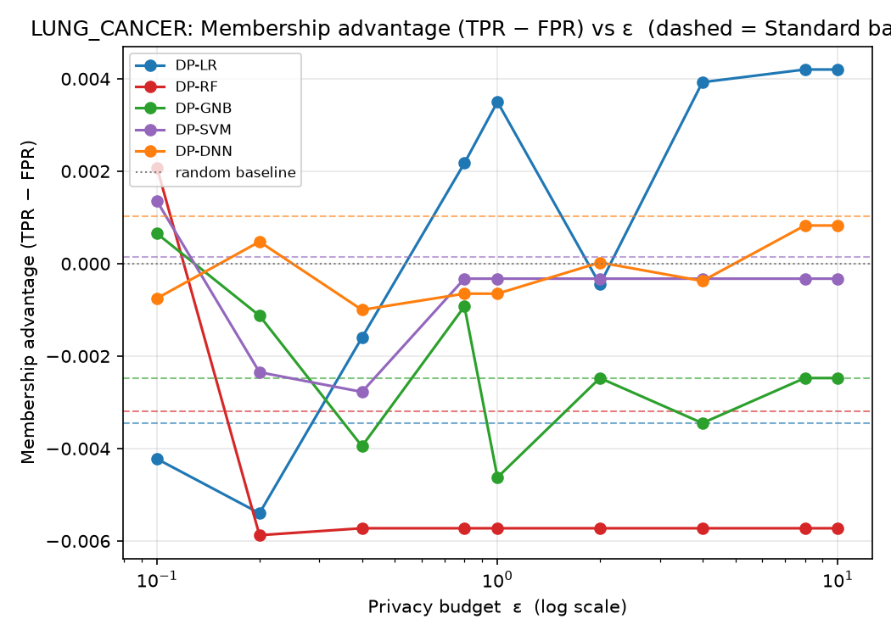
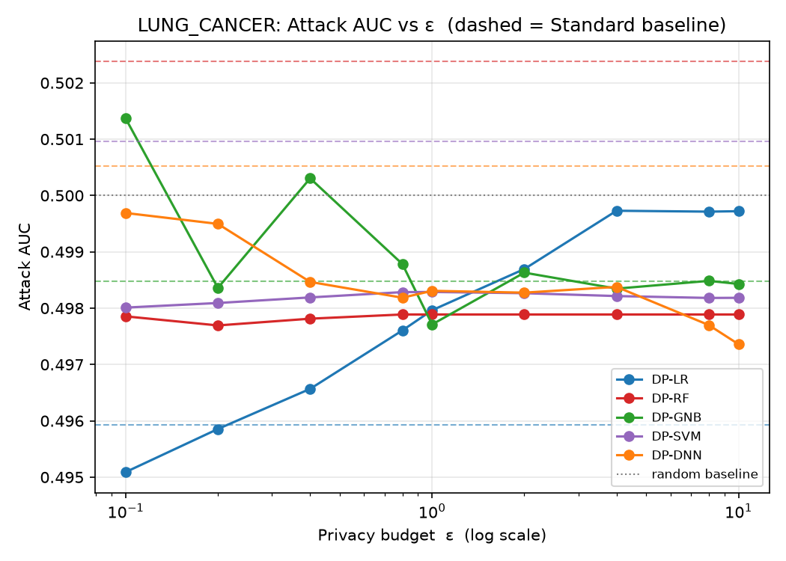
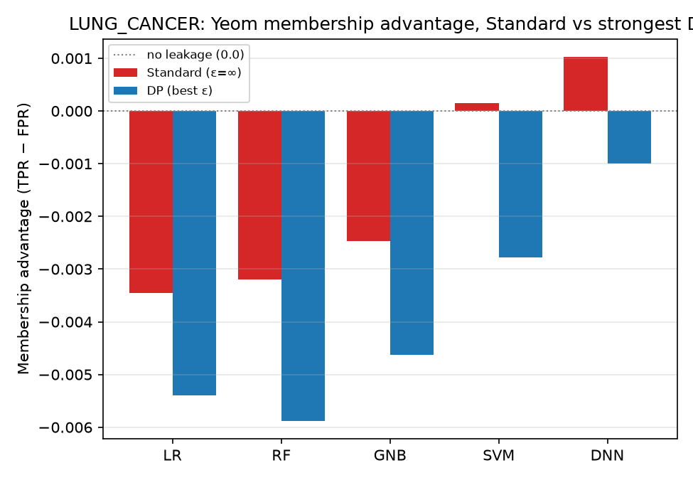
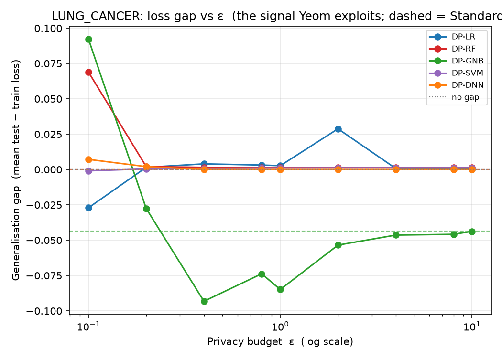

# LUNG_CANCER — Yeom MIA (loss-threshold) Analysis

*Auto-generated by `run_mia.py`. Raw numbers: `LUNG_CANCER_mia_results.csv`.*

Yeom, Giacomelli, Fredrikson, Jha (2018), *Privacy Risk in Machine Learning* (IEEE CSF) — run against the **exported** targets in `LUNG_CANCER/<family>/output/model/`.

## 1. Why Yeom, alongside LiRA
Yeom's attack is the **average-case** view: one global loss threshold τ (the mean training loss) applied to every record, scoring a model by the membership advantage TPR − FPR. It is the natural companion to the per-example LiRA (`Attack/LiRA`), which surfaces the *worst-case* records via TPR at a low fixed FPR. The leakage Yeom measures is driven by the model's generalisation gap, so the loss-gap figure is included as a mechanism plot.

## 2. What was run
| Item | Value |
|------|-------|
| Samples | N = 50000 (40000 train / 10000 test) |
| Classes | 3 |
| Features | 23 |
| DP budgets ε | 0.1, 0.2, 0.4, 0.8, 1, 2, 4, 8, 10 |
| Membership ground truth | record ∈ target's training set (X_train) |
| Per-sample signal | true-class cross-entropy −log p_true |
| Rule | predict IN if loss ≤ τ = mean training loss |

## 3. How to read it
| Metric | Meaning | No leak | Leak |
|--------|---------|---------|------|
| Advantage | TPR − FPR at τ (Yeom headline) | 0.0 | > 0.1 |
| Attack AUC | average-case ranking quality | 0.5 | > 0.6 |
| Loss gap | mean(test loss) − mean(train loss) | 0.0 | ≫ 0.0 |

## 4. Results
| Model | Variant | ε | Advantage | AUC | TPR | FPR | Loss gap | Test acc |
|-------|---------|---|-----------|-----|-----|-----|----------|----------|
| LR | Standard | ∞ | -0.003 | 0.496 | 0.710 | 0.713 | -0.000 | 1.000 |
| LR | DP | 0.1 | -0.004 | 0.495 | 0.873 | 0.877 | -0.027 | 0.834 |
| LR | DP | 0.2 | -0.005 | 0.496 | 0.772 | 0.778 | 0.002 | 0.878 |
| LR | DP | 0.4 | -0.002 | 0.497 | 0.793 | 0.795 | 0.004 | 0.944 |
| LR | DP | 0.8 | 0.002 | 0.498 | 0.765 | 0.763 | 0.003 | 0.979 |
| LR | DP | 1 | 0.003 | 0.498 | 0.746 | 0.743 | 0.003 | 0.979 |
| LR | DP | 2 | -0.000 | 0.499 | 0.926 | 0.926 | 0.029 | 0.927 |
| LR | DP | 4 | 0.004 | 0.500 | 0.782 | 0.778 | 0.001 | 1.000 |
| LR | DP | 8 | 0.004 | 0.500 | 0.779 | 0.775 | 0.000 | 1.000 |
| LR | DP | 10 | 0.004 | 0.500 | 0.779 | 0.775 | 0.000 | 1.000 |
| RF | Standard | ∞ | -0.003 | 0.502 | 0.657 | 0.660 | -0.000 | 1.000 |
| RF | DP | 0.1 | 0.002 | 0.498 | 0.817 | 0.815 | 0.069 | 0.870 |
| RF | DP | 0.2 | -0.006 | 0.498 | 0.627 | 0.633 | 0.002 | 0.899 |
| RF | DP | 0.4 | -0.006 | 0.498 | 0.646 | 0.652 | 0.002 | 0.880 |
| RF | DP | 0.8 | -0.006 | 0.498 | 0.646 | 0.652 | 0.002 | 0.880 |
| RF | DP | 1 | -0.006 | 0.498 | 0.646 | 0.652 | 0.002 | 0.880 |
| RF | DP | 2 | -0.006 | 0.498 | 0.646 | 0.652 | 0.002 | 0.880 |
| RF | DP | 4 | -0.006 | 0.498 | 0.646 | 0.652 | 0.002 | 0.880 |
| RF | DP | 8 | -0.006 | 0.498 | 0.646 | 0.652 | 0.002 | 0.880 |
| RF | DP | 10 | -0.006 | 0.498 | 0.646 | 0.652 | 0.002 | 0.880 |
| GNB | Standard | ∞ | -0.002 | 0.498 | 0.891 | 0.893 | -0.043 | 0.893 |
| GNB | DP | 0.1 | 0.001 | 0.501 | 0.729 | 0.728 | 0.092 | 0.615 |
| GNB | DP | 0.2 | -0.001 | 0.498 | 0.901 | 0.902 | -0.028 | 0.872 |
| GNB | DP | 0.4 | -0.004 | 0.500 | 0.717 | 0.721 | -0.093 | 0.678 |
| GNB | DP | 0.8 | -0.001 | 0.499 | 0.861 | 0.862 | -0.074 | 0.853 |
| GNB | DP | 1 | -0.005 | 0.498 | 0.910 | 0.915 | -0.085 | 0.915 |
| GNB | DP | 2 | -0.002 | 0.499 | 0.891 | 0.893 | -0.053 | 0.893 |
| GNB | DP | 4 | -0.003 | 0.498 | 0.901 | 0.904 | -0.046 | 0.893 |
| GNB | DP | 8 | -0.002 | 0.498 | 0.891 | 0.893 | -0.046 | 0.893 |
| GNB | DP | 10 | -0.002 | 0.498 | 0.891 | 0.893 | -0.044 | 0.893 |
| SVM | Standard | ∞ | 0.000 | 0.501 | 0.556 | 0.556 | 0.000 | 1.000 |
| SVM | DP | 0.1 | 0.001 | 0.498 | 0.821 | 0.819 | -0.001 | 0.932 |
| SVM | DP | 0.2 | -0.002 | 0.498 | 0.842 | 0.845 | 0.000 | 0.934 |
| SVM | DP | 0.4 | -0.003 | 0.498 | 0.880 | 0.882 | 0.001 | 0.942 |
| SVM | DP | 0.8 | -0.000 | 0.498 | 0.882 | 0.882 | 0.001 | 0.951 |
| SVM | DP | 1 | -0.000 | 0.498 | 0.882 | 0.882 | 0.001 | 0.951 |
| SVM | DP | 2 | -0.000 | 0.498 | 0.882 | 0.882 | 0.001 | 0.951 |
| SVM | DP | 4 | -0.000 | 0.498 | 0.882 | 0.882 | 0.001 | 0.951 |
| SVM | DP | 8 | -0.000 | 0.498 | 0.882 | 0.882 | 0.001 | 0.951 |
| SVM | DP | 10 | -0.000 | 0.498 | 0.882 | 0.882 | 0.001 | 0.951 |
| DNN | Standard | ∞ | 0.001 | 0.501 | 0.972 | 0.971 | 0.000 | 1.000 |
| DNN | DP | 0.1 | -0.001 | 0.500 | 0.941 | 0.942 | 0.007 | 0.968 |
| DNN | DP | 0.2 | 0.000 | 0.499 | 0.962 | 0.962 | 0.002 | 0.989 |
| DNN | DP | 0.4 | -0.001 | 0.498 | 0.940 | 0.941 | 0.000 | 1.000 |
| DNN | DP | 0.8 | -0.001 | 0.498 | 0.938 | 0.939 | 0.000 | 1.000 |
| DNN | DP | 1 | -0.001 | 0.498 | 0.938 | 0.939 | 0.000 | 1.000 |
| DNN | DP | 2 | 0.000 | 0.498 | 0.930 | 0.930 | 0.000 | 1.000 |
| DNN | DP | 4 | -0.000 | 0.498 | 0.929 | 0.930 | 0.000 | 1.000 |
| DNN | DP | 8 | 0.001 | 0.498 | 0.919 | 0.918 | 0.000 | 1.000 |
| DNN | DP | 10 | 0.001 | 0.497 | 0.919 | 0.918 | 0.000 | 1.000 |

## 5. Figures
### Membership advantage vs ε



Yeom advantage for each DP model across the budget; dashed = Standard baseline, dotted = no-leakage (0.0). Lower is more private.

### Attack AUC vs ε



Average-case ranking quality; 0.5 is random.

### Advantage: Standard vs strong DP



Per family, non-private vs strongest-privacy DP membership advantage.

### Generalisation gap vs ε



The signal Yeom exploits: test − train loss. DP shrinks the gap, which is why it suppresses the advantage.

## 6. Interpretation
Strongest average-case leakage among the **Standard** models: **DNN** at advantage = **0.001** (AUC 0.501), vs the 0.0 no-leakage baseline.

Under DP, the worst case drops to advantage = **0.004** (LR, ε=8) — quantifying the protection DP buys against the average-case attack.

> For the worst-case, per-record leakage on the same targets see the LiRA report in `Attack/LiRA/results/`.

## 7. Reproduce
```bash
cd Attack/MIA
python3 run_mia.py --datasets LUNG_CANCER
```